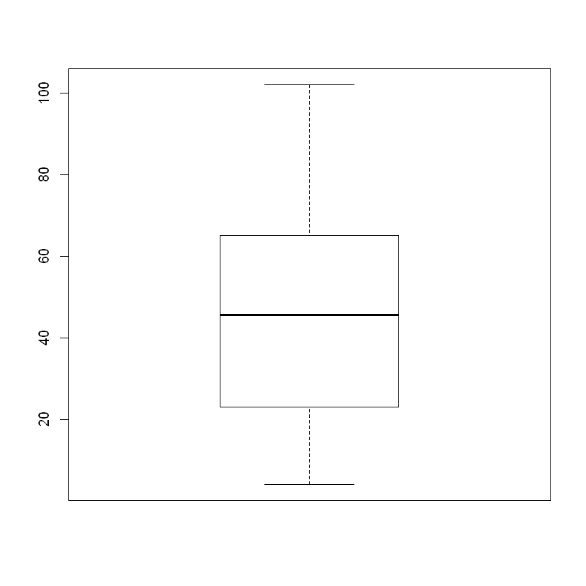
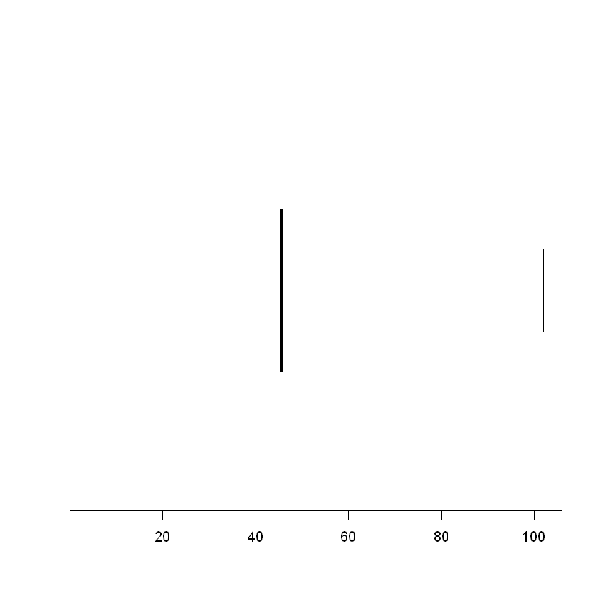
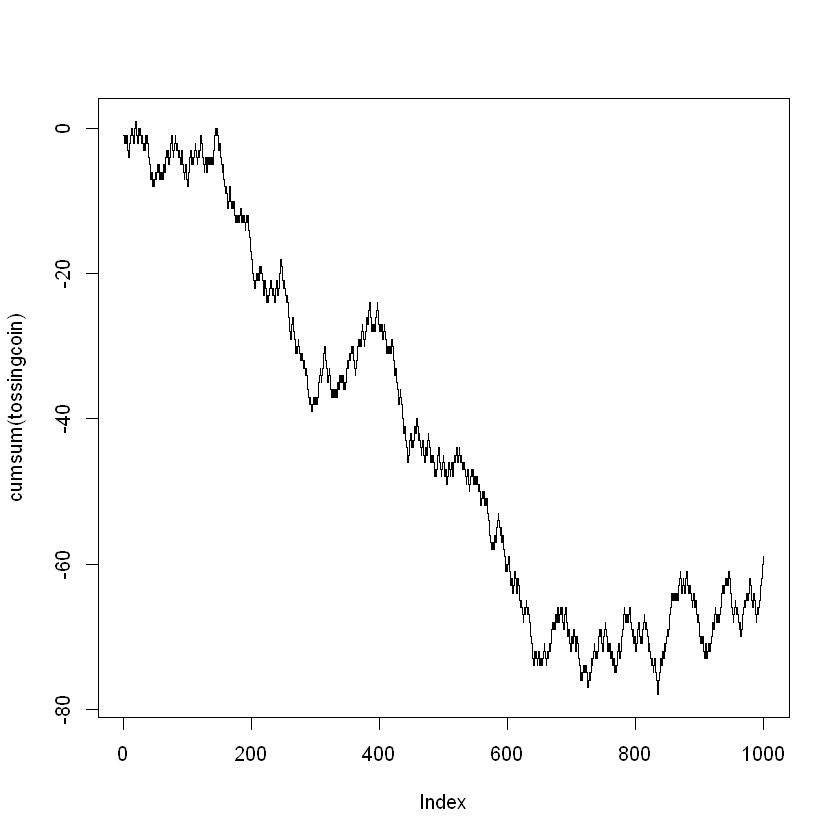
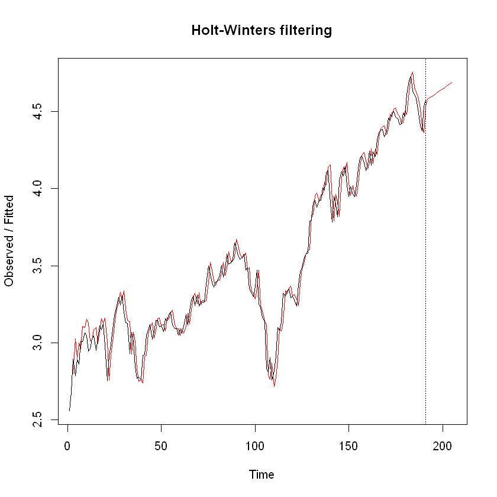
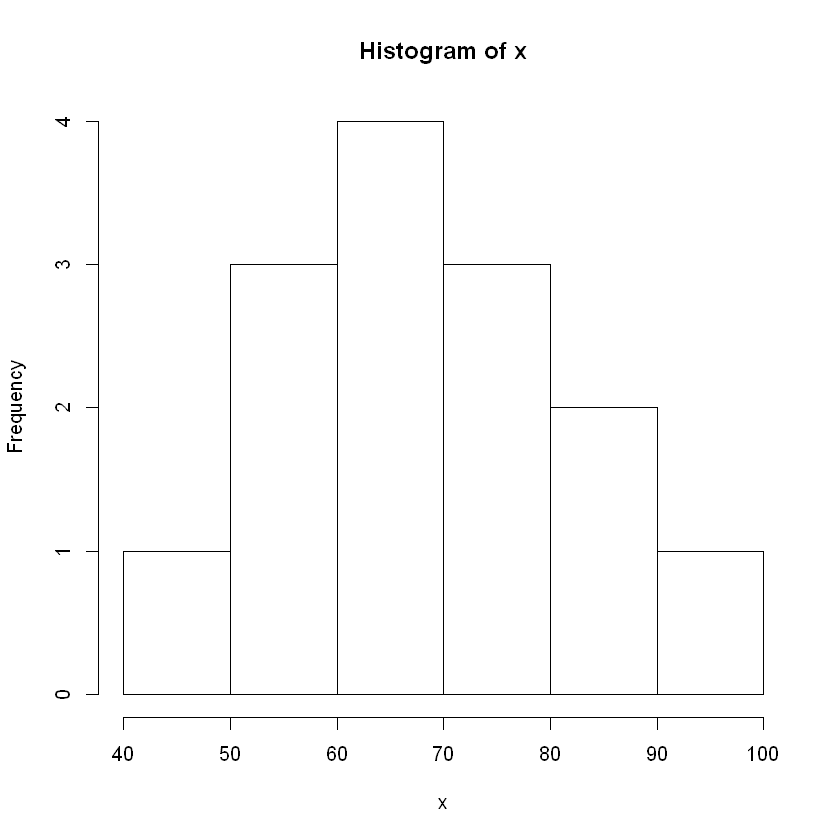
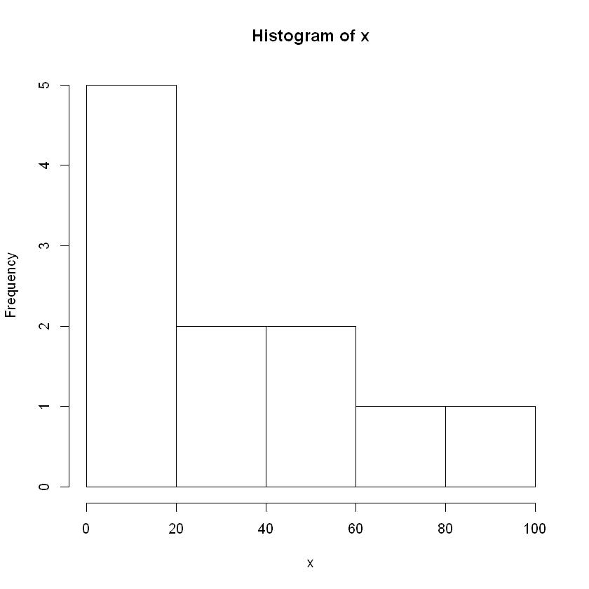
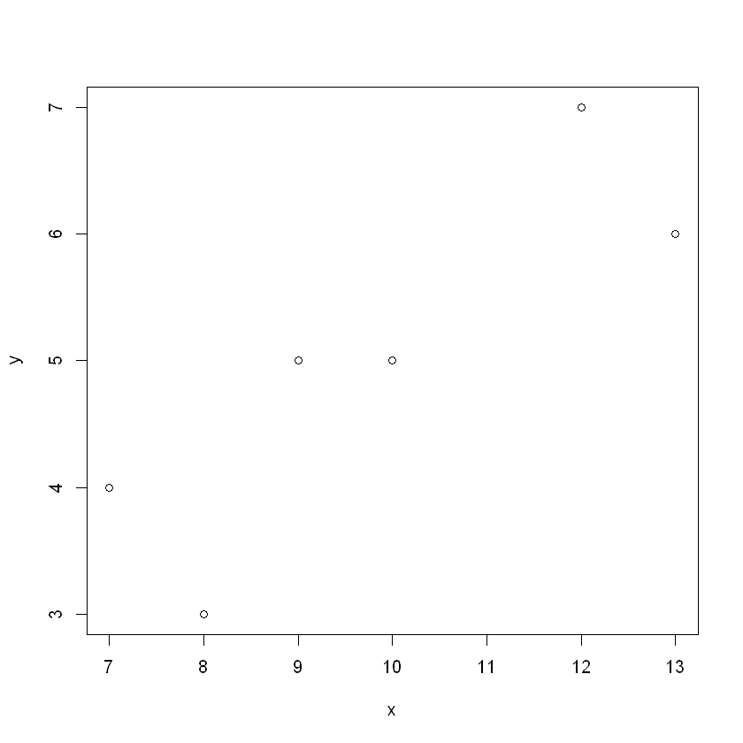

```R
################################
# P(exactly 8)
# P(x = 8)
# dbinom(a,size=n,prob=p)
dbinom(8, size=30, prob=.25)
# P(less than 17)
# P(x=0,1,2,...,16)
# P(x <= 16
# pbinom(a,size=n,prob=p)
pbinom(16,size=30,prob=.25)
# P(at most 12)
# P(x=0,1,2,...,12)
# P(x <= 12)
# pbinom(a,size=n,prob=p)
pbinom(12,size=30,prob=.25)

```


0.15930918764035


0.999784306173905


0.978406359120145


```R
################################
# P(more than 20)
# P(x = 21, 22, 23, 24, 25, 26, 27, 28, 29, 30)
# 1 - P(x=0,...,20)
# P(x >= 21)
# 1-pbinom(a-1,size=n,prob=p)
1-pbinom(21-1,size=30,prob=.25)
# P(at least 25)
# P(x=25,26,27,28,29,30)
# P(x >= 25)
# 1-pbinom(a-1,size=n,prob=p)
1-pbinom(25-1,size=30,prob=.25)
```


2.81832537640803e-07


3.20596882374957e-11


```R
################################
# P(between 10 and 20 inclusive)
# P(x=10,11,..,20)
# P(10 <= x <= 20)
# pbinom(b,size=n,prob=p)-pbinom(a-1,size=n,prob=p)
pbinom(20,size=30,prob=.25)-pbinom(10-1,size=30,prob=.25)
```


0.196593081217951


```R
################################
E = .05
clevel = .99
atl = clevel + (1 - clevel)/2
z = qnorm(atl)
# part a
phat = .23
n = phat * (1 - phat) * (z/E)^2
n
```


470.016075216343


```R
# part b
n = 0.25 * (z/E)^2
n
E = .2
sigma = 1.3
clevel = .95
atl = clevel + (1 - clevel)/2
z = qnorm(atl)
n = (z * sigma/E)^2
n
```


663.489660102121


162.301635174327


```R
################################
x1 = 200
n1 = 1000
x2 = 100
n2 = 780
clevel = .95
atl = clevel + (1 - clevel)/2
z = qnorm(atl)
phat1 = x1/n1
phat2 = x2/n2
lb = (phat1 - phat2) - z * sqrt(phat1 * (1 - phat1)/n1 + phat2 *
                                  (1 - phat2)/n2)
ub = (phat1 - phat2) + z * sqrt(phat1 * (1 - phat1)/n1 + phat2
                                * (1 - phat2)/n2)
lb
ub
```


0.0376614902726703


0.105928253317073


```R
################################
n = 25
xbar = 20.2
sigma = 2.1
clevel = .95
atl = clevel + (1 - clevel)/2
z = qnorm(atl)
lb = xbar - z * sigma/sqrt(n)
ub = xbar + z * sigma/sqrt(n)
lb
ub
```


19.3768151264932


21.0231848735068


```R
################################
n = 25
xbar = 20.2
s = 2.1
clevel = .95
atl = clevel + (1 - clevel)/2
t = qt(atl,df=n-1)
lb = xbar - t * s/sqrt(n)
ub = xbar + t * s/sqrt(n)
lb
ub
```


19.3331626041162


21.0668373958838


```R
################################
x = 50
n = 200
clevel = .95
atl = clevel + (1 - clevel)/2
z = qnorm(atl)
phat = x/n
lb = phat - z * sqrt(phat * (1-phat)/n)
ub = phat + z * sqrt(phat * (1-phat)/n)
lb
ub
```


0.189988604045559


0.310011395954441


```R
################################
n = 18
s = 2.5
clevel = .95
atl = (1 - clevel)/2
XL = qchisq(atl,df=n-1)
atl = clevel + (1 - clevel)/2
XR = qchisq(atl,df=n-1)
lb = sqrt( (n-1) * s^2/XR)
ub = sqrt( (n-1) * s^2/XL)
lb
ub
```


1.87596898789809


3.74785997538552


```R
################################
n = 25
s = 10.1
clevel = .98
atl = (1 - clevel)/2
XL = qchisq(atl,df=n-1)
atl = clevel + (1 - clevel)/2
XR = qchisq(atl,df=n-1)
lb = (n-1) * s^2/XR
ub = (n-1) * s^2/XL
lb
ub
```


56.9625464243958


225.51201942914


```R
################################
var1 = 20
n1 = 21
var2 = 31
n2 = 16
clevel = .95
atl = (1 - clevel)/2
FL = qf(atl,n1,n2)
atl = clevel + (1 - clevel)/2
FR = qf(atl,n1,n2)
lb = (var1/var2) * (1/FR)
ub = (var1/var2) * (1/FL)
lb
ub
```


0.242080862029108


1.61749612381827


```R
################################
x <- c(0,1,2,3,4)
prob <-
  c(0.20,0.30,0.25,0.15,0.10)
expected_value = sum(x *
                       prob)
expected_value
```


1.65


```R
################################
x <- c(0,1,2,3,4)
prob <- c(0.20,0.30,0.25,0.15,0.10)
mu = sum(x * prob)
variance = sum((x-mu)^2*prob)
sigma = sqrt(variance)
sigma
variance
```


1.23592070943083


1.5275


```R
################################
x <- c(4,13,21,23,27,35,41,50,59,61,65,73,81,102)
min(x)
quantile(x,0.25)
quantile(x,0.50)
quantile(x,0.75)
max(x)
```


4


<strong>25%:</strong> 24


<strong>50%:</strong> 45.5


<strong>75%:</strong> 64


102


```R
################################
x <- c(4,13,21,23,27,35,41,50,59,61,65,73,81,102)
boxplot(x)
```





```R
################################
x <- c(4,13,21,23,27,35,41,50,59,61,65,73,81,102)
boxplot(x,horizontal=TRUE,outline=FALSE)
```





```R
################################
bmw<-c(2.556606964, 2.67855273, 2.896409052, 2.783157674, 2.891704203,
       2.860542363, 3.010177438, 3.006078566, 3.065817881, 3.04599754,
       2.946331923, 2.959845995, 3.026358467, 3.04652044, 2.950368732,
       3.029070333, 3.110533089, 3.085024381, 3.119939077, 2.978535249,
       2.75219467,  2.915389521, 2.988153628, 3.086303972, 3.176594433,
       3.225732266, 3.294465556, 3.243529412, 3.304870018, 3.193147676, 3.129738553,
       3.127374383, 2.92905814, 3.068145954, 3.005435049, 2.843629495, 2.770085592,
       2.777451878, 2.759566804, 2.920092359, 2.92111648, 3.049652116, 3.082093439,
       3.116267075, 3.020815054, 3.067773826, 3.144712467, 3.145272341, 3.101892469,
       3.110666812, 3.072415498, 3.155850824, 3.14246983, 3.183704502, 3.198713933,
       3.113070766, 3.089495803, 3.090996998, 3.048798994, 3.092541329, 3.0610049,
       3.104945359, 3.18507082, 3.115690719, 3.207693535, 3.277106996, 3.30402547,
       3.241771702, 3.311746668, 3.23569361, 3.26617917, 3.258903904, 3.263772706,
       3.378303983, 3.497567605, 3.44470377, 3.389057322, 3.361797986, 3.395749234,
       3.396519792, 3.440065469, 3.503362798, 3.426215145, 3.469665671, 3.574197854,
       3.510470234, 3.516369605, 3.54208912, 3.649670741, 3.613670877, 3.567191931,
       3.540669427, 3.554004302, 3.575878715, 3.472742549, 3.488230981, 3.347761443,
       3.330774917, 3.297317251, 3.365535661, 3.471003256, 3.25091698, 3.224380646,
       3.163785859, 3.138099515, 2.833036858, 2.810907587, 2.904712875, 2.755251803,
       2.814689898, 2.913002626, 3.099236067, 3.078325572, 3.13366646, 3.322839365,
       3.302444616, 3.338754441, 3.349166974, 3.291345313, 3.303216973, 3.276465257,
       3.237776084, 3.375400827, 3.45817615, 3.488017074, 3.541857471, 3.572457991,
       3.581015808, 3.791774433, 3.79312685, 3.910581968, 3.926340026, 3.878135247,
       3.925156384, 3.924643037, 4.005057871, 3.99085267, 4.103485985, 4.118061089,
       3.903708536, 3.783462097, 3.950685871, 3.897132693, 3.81874476, 4.052497737,
       4.112446398, 4.083216204, 4.146161886, 4.01983651, 3.949145365, 4.014417126,
       3.961879268, 3.948779146, 4.0255481, 4.129615176, 4.196810894, 4.213400861,
       4.165765594, 4.11662777, 4.156520921, 4.241873366, 4.149384994, 4.240520672,
       4.208773832, 4.317394776, 4.367344376, 4.379586159, 4.387250467, 4.334240341,
       4.375203409, 4.459658747, 4.443815285, 4.494730125, 4.500465011, 4.464412748,
       4.456101571, 4.414856779, 4.418370618, 4.493210164, 4.469212996, 4.610565605,
       4.699352457, 4.72942998, 4.636349034, 4.6121458, 4.586802529, 4.514150788, 4.409398581,
       4.372228792, 4.536462988, 4.572233686) #logarithm of BMW stock price
bmw2<-ts(bmw) #indicate that bmw is a time series variable
hw<-HoltWinters(bmw2, gamma=FALSE) #implement Holt Winters method
hw #obtain the estimated coefficients
```


    Holt-Winters exponential smoothing with trend and without seasonal component.
    
    Call:
    HoltWinters(x = bmw2, gamma = FALSE)
    
    Smoothing parameters:
     alpha: 0.9705391
     beta : 0.09581481
     gamma: FALSE
    
    Coefficients:
             [,1]
    a 4.571180897
    b 0.008494273


```R
################################
tossingcoin <- sample(c(-1,1), 1000, replace = TRUE)
cumsum(tossingcoin)
plot(cumsum(tossingcoin), type = 's')
```


<ol class=list-inline>
	<li>-1</li>
	<li>-2</li>
	<li>-1</li>
	<li>-2</li>
	<li>-1</li>
	<li>-2</li>
	<li>-3</li>
	<li>-4</li>
	<li>-3</li>
	<li>-2</li>
	<li>-1</li>
	<li>0</li>
	<li>-1</li>
	<li>0</li>
	<li>-1</li>
	<li>-2</li>
	<li>-1</li>
	<li>0</li>
	<li>1</li>
	<li>0</li>
	<li>-1</li>
	<li>-2</li>
	<li>-1</li>
	<li>0</li>
	<li>-1</li>
	<li>0</li>
	<li>-1</li>
	<li>-2</li>
	<li>-1</li>
	<li>-2</li>
	<li>-3</li>
	<li>-2</li>
	<li>-3</li>
	<li>-2</li>
	<li>-1</li>
	<li>-2</li>
	<li>-1</li>
	<li>-2</li>
	<li>-3</li>
	<li>-4</li>
	<li>-5</li>
	<li>-6</li>
	<li>-7</li>
	<li>-6</li>
	<li>-7</li>
	<li>-8</li>
	<li>-7</li>
	<li>-8</li>
	<li>-7</li>
	<li>-6</li>
	<li>-7</li>
	<li>-6</li>
	<li>-5</li>
	<li>-6</li>
	<li>-5</li>
	<li>-6</li>
	<li>-7</li>
	<li>-6</li>
	<li>-7</li>
	<li>-6</li>
	<li>-7</li>
	<li>-6</li>
	<li>-5</li>
	<li>-6</li>
	<li>-5</li>
	<li>-4</li>
	<li>-3</li>
	<li>-4</li>
	<li>-3</li>
	<li>-4</li>
	<li>-5</li>
	<li>-4</li>
	<li>-3</li>
	<li>-2</li>
	<li>-1</li>
	<li>-2</li>
	<li>-3</li>
	<li>-4</li>
	<li>-3</li>
	<li>-2</li>
	<li>-1</li>
	<li>-2</li>
	<li>-3</li>
	<li>-2</li>
	<li>-3</li>
	<li>-4</li>
	<li>-3</li>
	<li>-4</li>
	<li>-5</li>
	<li>-4</li>
	<li>-3</li>
	<li>-4</li>
	<li>-5</li>
	<li>-6</li>
	<li>-7</li>
	<li>-6</li>
	<li>-5</li>
	<li>-6</li>
	<li>-7</li>
	<li>-8</li>
	<li>-7</li>
	<li>-6</li>
	<li>-5</li>
	<li>-4</li>
	<li>-3</li>
	<li>-4</li>
	<li>-5</li>
	<li>-4</li>
	<li>-5</li>
	<li>-4</li>
	<li>-3</li>
	<li>-2</li>
	<li>-3</li>
	<li>-4</li>
	<li>-5</li>
	<li>-4</li>
	<li>-3</li>
	<li>-4</li>
	<li>-3</li>
	<li>-2</li>
	<li>-1</li>
	<li>-2</li>
	<li>-3</li>
	<li>-4</li>
	<li>-5</li>
	<li>-6</li>
	<li>-5</li>
	<li>-4</li>
	<li>-5</li>
	<li>-6</li>
	<li>-5</li>
	<li>-4</li>
	<li>-5</li>
	<li>-4</li>
	<li>-5</li>
	<li>-4</li>
	<li>-5</li>
	<li>-4</li>
	<li>-5</li>
	<li>-4</li>
	<li>-3</li>
	<li>-2</li>
	<li>-1</li>
	<li>0</li>
	<li>-1</li>
	<li>0</li>
	<li>-1</li>
	<li>-2</li>
	<li>-3</li>
	<li>-2</li>
	<li>-3</li>
	<li>-4</li>
	<li>-5</li>
	<li>-6</li>
	<li>-5</li>
	<li>-6</li>
	<li>-7</li>
	<li>-8</li>
	<li>-9</li>
	<li>-8</li>
	<li>-9</li>
	<li>-10</li>
	<li>-11</li>
	<li>-10</li>
	<li>-9</li>
	<li>-8</li>
	<li>-9</li>
	<li>-10</li>
	<li>-11</li>
	<li>-10</li>
	<li>-11</li>
	<li>-10</li>
	<li>-11</li>
	<li>-12</li>
	<li>-13</li>
	<li>-12</li>
	<li>-13</li>
	<li>-12</li>
	<li>-13</li>
	<li>-12</li>
	<li>-13</li>
	<li>-12</li>
	<li>-11</li>
	<li>-12</li>
	<li>-13</li>
	<li>-12</li>
	<li>-13</li>
	<li>-12</li>
	<li>-13</li>
	<li>-14</li>
	<li>-13</li>
	<li>-12</li>
	<li>-13</li>
	<li>-12</li>
	<li>-13</li>
	<li>-14</li>
	<li>-15</li>
	<li>-16</li>
	<li>-17</li>
	<li>-18</li>
	<li>-19</li>
	<li>-20</li>
	<li>-21</li>
	<li>-22</li>
	<li>-21</li>
	<li>-22</li>
	<li>-21</li>
	<li>-20</li>
	<li>-21</li>
	<li>-20</li>
	<li>-21</li>
	<li>-20</li>
	<li>-19</li>
	<li>-20</li>
	<li>-19</li>
	<li>-20</li>
	<li>-21</li>
	<li>-22</li>
	<li>-23</li>
	<li>-22</li>
	<li>-21</li>
	<li>-22</li>
	<li>-23</li>
	<li>-24</li>
	<li>-23</li>
	<li>-24</li>
	<li>-23</li>
	<li>-22</li>
	<li>-21</li>
	<li>-22</li>
	<li>-21</li>
	<li>-22</li>
	<li>-23</li>
	<li>-22</li>
	<li>-23</li>
	<li>-24</li>
	<li>-23</li>
	<li>-22</li>
	<li>-21</li>
	<li>-22</li>
	<li>-23</li>
	<li>-22</li>
	<li>-21</li>
	<li>-20</li>
	<li>-19</li>
	<li>-18</li>
	<li>-19</li>
	<li>-20</li>
	<li>-21</li>
	<li>-22</li>
	<li>-21</li>
	<li>-22</li>
	<li>-23</li>
	<li>-24</li>
	<li>-23</li>
	<li>-24</li>
	<li>-25</li>
	<li>-26</li>
	<li>-27</li>
	<li>-28</li>
	<li>-29</li>
	<li>-28</li>
	<li>-27</li>
	<li>-26</li>
	<li>-27</li>
	<li>-28</li>
	<li>-29</li>
	<li>-30</li>
	<li>-31</li>
	<li>-30</li>
	<li>-31</li>
	<li>-30</li>
	<li>-29</li>
	<li>-30</li>
	<li>-31</li>
	<li>-32</li>
	<li>-31</li>
	<li>-32</li>
	<li>-31</li>
	<li>-32</li>
	<li>-33</li>
	<li>-32</li>
	<li>-33</li>
	<li>-34</li>
	<li>-33</li>
	<li>-34</li>
	<li>-35</li>
	<li>-36</li>
	<li>-37</li>
	<li>-38</li>
	<li>-37</li>
	<li>-38</li>
	<li>-39</li>
	<li>-38</li>
	<li>-39</li>
	<li>-38</li>
	<li>-37</li>
	<li>-38</li>
	<li>-37</li>
	<li>-38</li>
	<li>-37</li>
	<li>-38</li>
	<li>-37</li>
	<li>-36</li>
	<li>-35</li>
	<li>-34</li>
	<li>-33</li>
	<li>-34</li>
	<li>-35</li>
	<li>-34</li>
	<li>-33</li>
	<li>-32</li>
	<li>-31</li>
	<li>-30</li>
	<li>-31</li>
	<li>-32</li>
	<li>-33</li>
	<li>-34</li>
	<li>-35</li>
	<li>-34</li>
	<li>-33</li>
	<li>-34</li>
	<li>-35</li>
	<li>-36</li>
	<li>-37</li>
	<li>-36</li>
	<li>-37</li>
	<li>-36</li>
	<li>-37</li>
	<li>-36</li>
	<li>-37</li>
	<li>-36</li>
	<li>-37</li>
	<li>-36</li>
	<li>-35</li>
	<li>-36</li>
	<li>-35</li>
	<li>-34</li>
	<li>-35</li>
	<li>-34</li>
	<li>-35</li>
	<li>-34</li>
	<li>-35</li>
	<li>-36</li>
	<li>-35</li>
	<li>-36</li>
	<li>-35</li>
	<li>-34</li>
	<li>-33</li>
	<li>-32</li>
	<li>-33</li>
	<li>-32</li>
	<li>-31</li>
	<li>-32</li>
	<li>-31</li>
	<li>-30</li>
	<li>-31</li>
	<li>-30</li>
	<li>-31</li>
	<li>-32</li>
	<li>-33</li>
	<li>-34</li>
	<li>-33</li>
	<li>-32</li>
	<li>-31</li>
	<li>-30</li>
	<li>-29</li>
	<li>-30</li>
	<li>-29</li>
	<li>-30</li>
	<li>-29</li>
	<li>-28</li>
	<li>-27</li>
	<li>-28</li>
	<li>-29</li>
	<li>-30</li>
	<li>-29</li>
	<li>-28</li>
	<li>-27</li>
	<li>-26</li>
	<li>-27</li>
	<li>-26</li>
	<li>-25</li>
	<li>-24</li>
	<li>-25</li>
	<li>-26</li>
	<li>-27</li>
	<li>-28</li>
	<li>-27</li>
	<li>-28</li>
	<li>-27</li>
	<li>-28</li>
	<li>-27</li>
	<li>-26</li>
	<li>-25</li>
	<li>-24</li>
	<li>-25</li>
	<li>-26</li>
	<li>-27</li>
	<li>-28</li>
	<li>-27</li>
	<li>-28</li>
	<li>-27</li>
	<li>-28</li>
	<li>-29</li>
	<li>-28</li>
	<li>-27</li>
	<li>-28</li>
	<li>-29</li>
	<li>-30</li>
	<li>-31</li>
	<li>-30</li>
	<li>-31</li>
	<li>-30</li>
	<li>-31</li>
	<li>-30</li>
	<li>-31</li>
	<li>-30</li>
	<li>-29</li>
	<li>-30</li>
	<li>-31</li>
	<li>-32</li>
	<li>-33</li>
	<li>-34</li>
	<li>-33</li>
	<li>-34</li>
	<li>-35</li>
	<li>-36</li>
	<li>-37</li>
	<li>-38</li>
	<li>-37</li>
	<li>-36</li>
	<li>-37</li>
	<li>-38</li>
	<li>-39</li>
	<li>-40</li>
	<li>-41</li>
	<li>-42</li>
	<li>-41</li>
	<li>-42</li>
	<li>-43</li>
	<li>-44</li>
	<li>-45</li>
	<li>-46</li>
	<li>-45</li>
	<li>-44</li>
	<li>-43</li>
	<li>-42</li>
	<li>-43</li>
	<li>-44</li>
	<li>-43</li>
	<li>-44</li>
	<li>-43</li>
	<li>-42</li>
	<li>-41</li>
	<li>-42</li>
	<li>-41</li>
	<li>-40</li>
	<li>-41</li>
	<li>-42</li>
	<li>-43</li>
	<li>-42</li>
	<li>-43</li>
	<li>-44</li>
	<li>-45</li>
	<li>-44</li>
	<li>-43</li>
	<li>-44</li>
	<li>-45</li>
	<li>-46</li>
	<li>-45</li>
	<li>-44</li>
	<li>-45</li>
	<li>-44</li>
	<li>-43</li>
	<li>-42</li>
	<li>-43</li>
	<li>-44</li>
	<li>-45</li>
	<li>-46</li>
	<li>-45</li>
	<li>-46</li>
	<li>-45</li>
	<li>-46</li>
	<li>-47</li>
	<li>-48</li>
	<li>-47</li>
	<li>-48</li>
	<li>-47</li>
	<li>-46</li>
	<li>-45</li>
	<li>-44</li>
	<li>-45</li>
	<li>-46</li>
	<li>-47</li>
	<li>-48</li>
	<li>-47</li>
	<li>-46</li>
	<li>-45</li>
	<li>-46</li>
	<li>-47</li>
	<li>-48</li>
	<li>-47</li>
	<li>-48</li>
	<li>-49</li>
	<li>-48</li>
	<li>-47</li>
	<li>-46</li>
	<li>-47</li>
	<li>-48</li>
	<li>-47</li>
	<li>-46</li>
	<li>-47</li>
	<li>-48</li>
	<li>-47</li>
	<li>-46</li>
	<li>-45</li>
	<li>-46</li>
	<li>-45</li>
	<li>-44</li>
	<li>-45</li>
	<li>-46</li>
	<li>-45</li>
	<li>-44</li>
	<li>-45</li>
	<li>-46</li>
	<li>-45</li>
	<li>-46</li>
	<li>-47</li>
	<li>-46</li>
	<li>-47</li>
	<li>-46</li>
	<li>-47</li>
	<li>-48</li>
	<li>-49</li>
	<li>-48</li>
	<li>-47</li>
	<li>-48</li>
	<li>-49</li>
	<li>-50</li>
	<li>-49</li>
	<li>-48</li>
	<li>-47</li>
	<li>-48</li>
	<li>-47</li>
	<li>-48</li>
	<li>-49</li>
	<li>-48</li>
	<li>-49</li>
	<li>-48</li>
	<li>-49</li>
	<li>-48</li>
	<li>-49</li>
	<li>-50</li>
	<li>-49</li>
	<li>-50</li>
	<li>-51</li>
	<li>-52</li>
	<li>-51</li>
	<li>-50</li>
	<li>-51</li>
	<li>-50</li>
	<li>-51</li>
	<li>-52</li>
	<li>-51</li>
	<li>-52</li>
	<li>-51</li>
	<li>-52</li>
	<li>-53</li>
	<li>-54</li>
	<li>-55</li>
	<li>-56</li>
	<li>-57</li>
	<li>-58</li>
	<li>-57</li>
	<li>-58</li>
	<li>-57</li>
	<li>-58</li>
	<li>-57</li>
	<li>-56</li>
	<li>-57</li>
	<li>-56</li>
	<li>-55</li>
	<li>-54</li>
	<li>-53</li>
	<li>-54</li>
	<li>-55</li>
	<li>-56</li>
	<li>-55</li>
	<li>-56</li>
	<li>-57</li>
	<li>-56</li>
	<li>-57</li>
	<li>-58</li>
	<li>-59</li>
	<li>-60</li>
	<li>-61</li>
	<li>-60</li>
	<li>-61</li>
	<li>-60</li>
	<li>-59</li>
	<li>-60</li>
	<li>-61</li>
	<li>-62</li>
	<li>-63</li>
	<li>-62</li>
	<li>-63</li>
	<li>-64</li>
	<li>-63</li>
	<li>-62</li>
	<li>-61</li>
	<li>-62</li>
	<li>-63</li>
	<li>-64</li>
	<li>-63</li>
	<li>-62</li>
	<li>-63</li>
	<li>-64</li>
	<li>-65</li>
	<li>-66</li>
	<li>-65</li>
	<li>-66</li>
	<li>-67</li>
	<li>-68</li>
	<li>-67</li>
	<li>-66</li>
	<li>-67</li>
	<li>-66</li>
	<li>-65</li>
	<li>-66</li>
	<li>-67</li>
	<li>-66</li>
	<li>-67</li>
	<li>-68</li>
	<li>-69</li>
	<li>-70</li>
	<li>-71</li>
	<li>-72</li>
	<li>-73</li>
	<li>-74</li>
	<li>-73</li>
	<li>-72</li>
	<li>-73</li>
	<li>-72</li>
	<li>-73</li>
	<li>-74</li>
	<li>-73</li>
	<li>-72</li>
	<li>-73</li>
	<li>-74</li>
	<li>-73</li>
	<li>-74</li>
	<li>-73</li>
	<li>-74</li>
	<li>-73</li>
	<li>-72</li>
	<li>-71</li>
	<li>-72</li>
	<li>-73</li>
	<li>-74</li>
	<li>-73</li>
	<li>-72</li>
	<li>-73</li>
	<li>-72</li>
	<li>-71</li>
	<li>-72</li>
	<li>-71</li>
	<li>-70</li>
	<li>-69</li>
	<li>-68</li>
	<li>-69</li>
	<li>-68</li>
	<li>-69</li>
	<li>-68</li>
	<li>-67</li>
	<li>-68</li>
	<li>-67</li>
	<li>-66</li>
	<li>-67</li>
	<li>-68</li>
	<li>-67</li>
	<li>-66</li>
	<li>-67</li>
	<li>-66</li>
	<li>-67</li>
	<li>-68</li>
	<li>-69</li>
	<li>-68</li>
	<li>-67</li>
	<li>-66</li>
	<li>-67</li>
	<li>-68</li>
	<li>-69</li>
	<li>-70</li>
	<li>-69</li>
	<li>-70</li>
	<li>-71</li>
	<li>-72</li>
	<li>-71</li>
	<li>-70</li>
	<li>-71</li>
	<li>-70</li>
	<li>-69</li>
	<li>-70</li>
	<li>-71</li>
	<li>-72</li>
	<li>-71</li>
	<li>-70</li>
	<li>-71</li>
	<li>-72</li>
	<li>-73</li>
	<li>-74</li>
	<li>-75</li>
	<li>-76</li>
	<li>-75</li>
	<li>-76</li>
	<li>-75</li>
	<li>-74</li>
	<li>-75</li>
	<li>-74</li>
	<li>-75</li>
	<li>-74</li>
	<li>-75</li>
	<li>-76</li>
	<li>-77</li>
	<li>-76</li>
	<li>-75</li>
	<li>-76</li>
	<li>-75</li>
	<li>-74</li>
	<li>-73</li>
	<li>-74</li>
	<li>-73</li>
	<li>-72</li>
	<li>-71</li>
	<li>-72</li>
	<li>-73</li>
	<li>-72</li>
	<li>-73</li>
	<li>-72</li>
	<li>-71</li>
	<li>-70</li>
	<li>-69</li>
	<li>-70</li>
	<li>-69</li>
	<li>-70</li>
	<li>-71</li>
	<li>-72</li>
	<li>-71</li>
	<li>-70</li>
	<li>-69</li>
	<li>-68</li>
	<li>-69</li>
	<li>-70</li>
	<li>-71</li>
	<li>-72</li>
	<li>-71</li>
	<li>-72</li>
	<li>-71</li>
	<li>-72</li>
	<li>-73</li>
	<li>-72</li>
	<li>-73</li>
	<li>-74</li>
	<li>-73</li>
	<li>-74</li>
	<li>-75</li>
	<li>-74</li>
	<li>-75</li>
	<li>-74</li>
	<li>-73</li>
	<li>-72</li>
	<li>-71</li>
	<li>-72</li>
	<li>-73</li>
	<li>-72</li>
	<li>-71</li>
	<li>-70</li>
	<li>-69</li>
	<li>-68</li>
	<li>-67</li>
	<li>-66</li>
	<li>-67</li>
	<li>-68</li>
	<li>-67</li>
	<li>-68</li>
	<li>-67</li>
	<li>-68</li>
	<li>-67</li>
	<li>-66</li>
	<li>-67</li>
	<li>-68</li>
	<li>-69</li>
	<li>-70</li>
	<li>-69</li>
	<li>-70</li>
	<li>-71</li>
	<li>-70</li>
	<li>-71</li>
	<li>-72</li>
	<li>-71</li>
	<li>-70</li>
	<li>-69</li>
	<li>-68</li>
	<li>-69</li>
	<li>-70</li>
	<li>-71</li>
	<li>-70</li>
	<li>-71</li>
	<li>-70</li>
	<li>-69</li>
	<li>-68</li>
	<li>-67</li>
	<li>-68</li>
	<li>-69</li>
	<li>-68</li>
	<li>-69</li>
	<li>-70</li>
	<li>-71</li>
	<li>-72</li>
	<li>-71</li>
	<li>-72</li>
	<li>-73</li>
	<li>-74</li>
	<li>-73</li>
	<li>-74</li>
	<li>-75</li>
	<li>-74</li>
	<li>-73</li>
	<li>-74</li>
	<li>-75</li>
	<li>-76</li>
	<li>-77</li>
	<li>-78</li>
	<li>-77</li>
	<li>-76</li>
	<li>-75</li>
	<li>-74</li>
	<li>-73</li>
	<li>-74</li>
	<li>-73</li>
	<li>-72</li>
	<li>-73</li>
	<li>-72</li>
	<li>-71</li>
	<li>-72</li>
	<li>-71</li>
	<li>-70</li>
	<li>-69</li>
	<li>-70</li>
	<li>-69</li>
	<li>-68</li>
	<li>-67</li>
	<li>-66</li>
	<li>-65</li>
	<li>-64</li>
	<li>-65</li>
	<li>-64</li>
	<li>-65</li>
	<li>-64</li>
	<li>-65</li>
	<li>-64</li>
	<li>-65</li>
	<li>-64</li>
	<li>-65</li>
	<li>-64</li>
	<li>-63</li>
	<li>-62</li>
	<li>-61</li>
	<li>-62</li>
	<li>-63</li>
	<li>-64</li>
	<li>-63</li>
	<li>-62</li>
	<li>-63</li>
	<li>-64</li>
	<li>-63</li>
	<li>-62</li>
	<li>-61</li>
	<li>-62</li>
	<li>-63</li>
	<li>-64</li>
	<li>-63</li>
	<li>-64</li>
	<li>-63</li>
	<li>-64</li>
	<li>-65</li>
	<li>-66</li>
	<li>-65</li>
	<li>-64</li>
	<li>-65</li>
	<li>-66</li>
	<li>-65</li>
	<li>-66</li>
	<li>-67</li>
	<li>-68</li>
	<li>-67</li>
	<li>-68</li>
	<li>-69</li>
	<li>-70</li>
	<li>-71</li>
	<li>-70</li>
	<li>-71</li>
	<li>-70</li>
	<li>-71</li>
	<li>-72</li>
	<li>-73</li>
	<li>-72</li>
	<li>-71</li>
	<li>-72</li>
	<li>-73</li>
	<li>-72</li>
	<li>-71</li>
	<li>-72</li>
	<li>-71</li>
	<li>-72</li>
	<li>-71</li>
	<li>-70</li>
	<li>-69</li>
	<li>-68</li>
	<li>-69</li>
	<li>-68</li>
	<li>-67</li>
	<li>-66</li>
	<li>-67</li>
	<li>-68</li>
	<li>-67</li>
	<li>-68</li>
	<li>-67</li>
	<li>-68</li>
	<li>-67</li>
	<li>-66</li>
	<li>-65</li>
	<li>-64</li>
	<li>-63</li>
	<li>-64</li>
	<li>-63</li>
	<li>-64</li>
	<li>-63</li>
	<li>-62</li>
	<li>-63</li>
	<li>-62</li>
	<li>-63</li>
	<li>-62</li>
	<li>-61</li>
	<li>-62</li>
	<li>-63</li>
	<li>-64</li>
	<li>-65</li>
	<li>-66</li>
	<li>-67</li>
	<li>-68</li>
	<li>-67</li>
	<li>-66</li>
	<li>-65</li>
	<li>-66</li>
	<li>-67</li>
	<li>-66</li>
	<li>-67</li>
	<li>-68</li>
	<li>-69</li>
	<li>-68</li>
	<li>-69</li>
	<li>-70</li>
	<li>-69</li>
	<li>-68</li>
	<li>-67</li>
	<li>-66</li>
	<li>-65</li>
	<li>-66</li>
	<li>-65</li>
	<li>-64</li>
	<li>-65</li>
	<li>-64</li>
	<li>-65</li>
	<li>-64</li>
	<li>-63</li>
	<li>-62</li>
	<li>-63</li>
	<li>-64</li>
	<li>-65</li>
	<li>-66</li>
	<li>-65</li>
	<li>-64</li>
	<li>-65</li>
	<li>-66</li>
	<li>-67</li>
	<li>-68</li>
	<li>-67</li>
	<li>-66</li>
	<li>-67</li>
	<li>-66</li>
	<li>-65</li>
	<li>-64</li>
	<li>-63</li>
	<li>-62</li>
	<li>-61</li>
	<li>-60</li>
	<li>-59</li>
	<li>-60</li>
</ol>





```R
################################
pred <- predict(hw, n.ahead = 14, prediction.interval = FALSE)
#estimate the 14 predictions ahead
pred #obtain the predictions
plot(hw, pred) #obtain the graph
#the red line shows the predicted values while the black line
#indicates the stock price evolution
```


    Time Series:
    Start = 192 
    End = 205 
    Frequency = 1 
               fit
     [1,] 4.579675
     [2,] 4.588169
     [3,] 4.596664
     [4,] 4.605158
     [5,] 4.613652
     [6,] 4.622147
     [7,] 4.630641
     [8,] 4.639135
     [9,] 4.647629
    [10,] 4.656124
    [11,] 4.664618
    [12,] 4.673112
    [13,] 4.681606
    [14,] 4.690101





```R
################################
alpha = 8
beta = 1
gamma = factorial(alpha - 1)
a = 3
b = 4
f = function(x){(x^(alpha-1)*exp(-x/beta))/(beta ^ alpha *
                                              gamma)}
integrate(f,a,b)
```


    0.03922911 with absolute error < 4.4e-16


```R
################################
observed <- c(200,150,350,20)
prob <- c(0.25,0.20,0.50,0.05)
chisq.test(observed,p=prob)
```


    
    	Chi-squared test for given probabilities
    
    data:  observed
    X-squared = 9.8611, df = 3, p-value = 0.01978
    


```R
################################
x <- c(23, 27, 29, 35, 37, 37, 39, 40, 42, 45, 51)
breaks = seq(20,60,by=10)
xcut = cut(x,breaks,right=FALSE)
freq = table(xcut)
freq
```


    xcut
    [20,30) [30,40) [40,50) [50,60) 
          3       4       3       1 


```R
################################
x <- c(1,2,8,13)
y <- c(10,15,35,44)
t_line = lm(y ~ x)
t_line
x <- c(3,5,7,9)
y <- c(17,23,41,50)
t_line = lm(y ~ x)
t_line
#form yhat = mx + b
#form yhat = b1*x + b0
coeffs = coefficients(t_line)
b0 = coeffs[1]
b1 = coeffs[2]
b1 * 21 + b0
```


    
    Call:
    lm(formula = y ~ x)
    
    Coefficients:
    (Intercept)            x  
          8.894        2.851  
    


    
    Call:
    lm(formula = y ~ x)
    
    Coefficients:
    (Intercept)            x  
          -2.35         5.85  
    


<strong>x:</strong> 120.5


```R
################################
one <- c(1,1)
xval <- c(1,2)
yval <- c(2,5)
X <- matrix(c(one,xval),nrow=2,ncol=2)
Y <- matrix(c(yval),nrow=2,ncol=1)
solve(t(X) %*% X) %*% t(X) %*% Y
```


<table>
<tbody>
	<tr><td>-1</td></tr>
	<tr><td> 3</td></tr>
</tbody>
</table>


```R
################################
one <- c(1,1,1)
x1val <- c(1,4,3)
x2val <- c(2,-1,1)
yval <- c(9,3,9)
X <- matrix(c(one,x1val,x2val),nrow=3,ncol=3)
Y <- matrix(c(yval),nrow=3,ncol=1)
solve(t(X) %*% X) %*% t(X) %*% Y
```


<table>
<tbody>
	<tr><td>-1</td></tr>
	<tr><td> 2</td></tr>
	<tr><td> 4</td></tr>
</tbody>
</table>


```R
################################
one <- c(1,1,1)
xval <- c(1,2,3)
yval <- c(2,5,4)
X <- matrix(c(one,xval),nrow=3,ncol=2)
Y <- matrix(c(yval),nrow=3,ncol=1)
betahat = solve(t(X) %*% X) %*% t(X) %*% Y
betahat
SSE = t(Y) %*% Y - t(betahat) %*% t(X) %*% Y
SSE
```


<table>
<tbody>
	<tr><td>1.666667</td></tr>
	<tr><td>1.000000</td></tr>
</tbody>
</table>


<table>
<tbody>
	<tr><td>2.666667</td></tr>
</tbody>
</table>


```R

################################
x <- c(3,5,7,9)
y <- c(17,23,41,50)
t_line = lm(y ~ x)
coeffs = coefficients(t_line)
b0 = coeffs[1]
b1 = coeffs[2]
# form: yhat = b1(x) + b0
yhat = b1 * x + b0
# (y - yhat)^2 and then sum them
sum((y-yhat)^2)
```


24.3


```R
################################
x <- c(40,51,53,55,65,67,69,70,72,75,76,81,83,99)
hist(x)
```





```R
################################
lcl <- c(10,20,30,40)
ucl <- c(19,29,39,49)
midpoints = (lcl + ucl)/2
midpoints
```


<ol class=list-inline>
	<li>14.5</li>
	<li>24.5</li>
	<li>34.5</li>
	<li>44.5</li>
</ol>


```R
################################
lcl <- c(10,20,30,40)
ucl <- c(19,29,39,49)
new_midpoints <- c()
for (i in 1:length(lcl))
{
  new_midpoints[i] = (lcl[i] + ucl[i])/2
}
new_midpoints
```


<ol class=list-inline>
	<li>14.5</li>
	<li>24.5</li>
	<li>34.5</li>
	<li>44.5</li>
</ol>


```R
################################
lcl <- c(10,20,30,40)
ucl <- c(19,29,39,49)
f <- c(5,31,12,2)
x = (lcl+ucl)/2
xbar = sum(f * x)/sum(f)
xbar
```


26.7


```R
################################
lcl <- c(10,20,30,40)
ucl <- c(19,29,39,49)
f <- c(5,31,12,2)
x <- c()
```


```R
################################
# create the midpoints
for (i in 1:length(lcl))
{
  x[i] = (lcl[i] + ucl[i])/2
}
sum_freq = 0
sum_ftimesx = 0
for (i in 1:length(lcl))
{
  sum_freq = sum_freq + f[i]
  sum_ftimesx = sum_ftimesx + f[i] * x[i]
}
xbar = sum_ftimesx/sum_freq
print(xbar)
```

    [1] 26.7
    


```R
################################
lcl <- c(10,20,30,40)
ucl <- c(19,29,39,49)
f <- c(5,31,12,2)
x <- (lcl + ucl)/2
mean = sum(f * x)/sum(f)
mean
top_sum = sum((x - mean)^2 * f)
sample_stdev = sqrt(top_sum/(sum(f) - 1))
sample_stdev
```


26.7


6.78834535458098


```R
################################
lcl <- c(10,20,30,40)
ucl <- c(19,29,39,49)
f <- c(5,31,12,2)
x <- (lcl + ucl)/2
mean = sum(f * x)/sum(f)
mean
top_sum = sum((x - mean)^2 * f)
pop_stdev = sqrt(top_sum/sum(f))
pop_stdev
```


26.7


6.72011904656458


```R
################################
lcl <- c(10,20,30,40)
ucl <- c(19,29,39,49)
f <- c(5,31,12,2)
x <- (lcl + ucl)/2
mean = sum(f * x)/sum(f)
mean
top_sum = sum((x - mean)^2 * f)
pop_stdev = sqrt(top_sum/sum(f))
pop_stdev
pop_variance = pop_stdev^2
pop_variance
```


26.7


6.72011904656458


45.16


```R
################################
weights <- c(0.10,0.20,0.50,0.20)
grades <- c(100,80,70,30)
course_average = sum(weights * grades)/sum(weights)
course_average
################################
weights <- c(10,20,50,20)
grades <- c(100,80,70,30)
course_average = sum(weights * grades)/sum(weights)
course_average
```


67


67


```R
################################
x <- c(2, 5, 7, 11, 12, 21, 25, 31, 45, 72, 81, 102)
quantile(x,0.25)
quantile(x,0.50)
quantile(x,0.75)
```


<strong>25%:</strong> 10


<strong>50%:</strong> 23


<strong>75%:</strong> 51.75


```R
################################
x <- c(25,2,31,12)
newx = sort(x)
newx
```


<ol class=list-inline>
	<li>2</li>
	<li>12</li>
	<li>25</li>
	<li>31</li>
</ol>


```R
################################
x <- c(3.5, 3.2, 4.1, 4.7, 3.8, 5.1, 7.2, 3.9, 5.3, 6.1, 6.2, 3.1, 9.3,
       9.4, 10.5, 10.9, 11.1, 11.2, 12.7, 12.8, 13.1, 13.5, 17, 38.6)
q1 = quantile(x,0.25)
q3 = quantile(x,0.75)
iqr = q3 - q1
lf = q1 - 1.5 * iqr
uf = q3 + 1.5 * iqr
lf
uf

```


<strong>25%:</strong> -5.9875


<strong>75%:</strong> 22.1125


```R
################################
x <- c(20, 31, 42, 51, 55, 57, 60, 65, 70, 80)
range = max(x) - min(x)
range
```


60


```R

################################
x <- c(2,8,20,50)
tsum = sum((x-mean(x))^2)
pop_stdev = sqrt(tsum/length(x))
pop_stdev
```


18.4932420089069


```R
################################
x <- c(2,8,20,50)
# find the mean
tsum = 0
for (i in 1:length(x))
{
  tsum = tsum + x[i]
}
mean = tsum/length(x)
# calculate sum of (x-mean)^2
newsum = 0
for (i in 1:length(x))
{
  newsum = newsum + (x[i] - mean)^2
}
# find population standard deviation
pop_stdev = sqrt(newsum/length(x))
pop_stdev
```


18.4932420089069


```R
################################
x <- c(2,8,20,50)
sd(x)
```


21.3541565040626


```R

################################
x <- c(2,8,20,50)
sample_variance = sd(x)^2
sample_variance
```


456


```R
################################
x <- c(2,8,20,50)
tsum = sum((x-mean(x))^2)
pop_stdev = sqrt(tsum/length(x))
pop_variance = pop_stdev^2
pop_variance
```


342


```R
################################
x <- c(2, 8, 12, 13, 21, 32, 45, 51, 72, 81)
tsum = sum((x-mean(x))^2)
pop_stdev = sqrt(tsum/length(x))
pop_mean = mean(x)
CV = pop_stdev/pop_mean * 100
CV
```


77.7204528415696


```R
################################
x <- c(2, 8, 12, 13, 21, 32, 45, 51, 72, 81)
tsum = sum((x-mean(x))^2)
pop_stdev = sqrt(tsum/length(x))
pop_mean = mean(x)
pop_median = median(x)
sk = (3 * (pop_mean - pop_median))/pop_stdev
sk
```


0.824685821379213


```R
################################
x <- c(1, 2, 8, 12, 13, 21, 32, 45, 51, 72, 81)
tsum = sum((x-mean(x))^2)
pop_stdev = sqrt(tsum/length(x))
pop_mean = mean(x)
pop_median = median(x)
sk = (3 * (pop_mean - pop_median))/pop_stdev
sk
hist(x)
```


1.0936221794622





```R
################################
startval = 10
endval = 20
x <- c(2,12,15,31,32,45,58)
count = 0
for (i in 1:length(x))
{
  if (x[i] >= startval && x[i] <= endval)
    count = count + 1
}
actualp = count/length(x) * 100
actualp
```


28.5714285714286


```R
################################
n = 500
p = .20
# P(x is less than 90)
# P(x <= 89.5)
# case 1
pnorm(89.5,mean=n*p,sd=sqrt(n*p*(1-p)),lower.tail=TRUE)
# P(x is at most 92)
# P(x <= 92.5)
# case 1
pnorm(92.5,mean=n*p,sd=sqrt(n*p*(1-p)),lower.tail=TRUE)
# P(x is more than 105)
# P(x >= 105.5)
pnorm(105.5,mean=n*p,sd=sqrt(n*p*(1-p)),lower.tail=FALSE)
# P(x is at least 100)
# P(x >= 99.5)
pnorm(99.5,mean=n*p,sd=sqrt(n*p*(1-p)),lower.tail=FALSE)
# P(between 90 and 98, inclusive)
# P(89.5 <= x <= 98.5)
pnorm(98.5,mean=n*p,sd=sqrt(n*p*(1-p)),lower.tail=TRUE)-
  pnorm(89.5,mean=n*p,sd=sqrt(n*p*(1-p)),lower.tail=TRUE)
```


0.120210393184218


0.200867818527699


0.269304208340612


0.522289941503218


0.313197249379494


```R
################################
# P(exactly 8)
# P(x = 8)
# dpois(a,lambda=lam)
a = 3
t = 5
lam = a * t
dpois(8,lambda=lam)
# P(less than 17)
# P(x=0,1,2,...16)
# P(x <= 16)
# ppois(a,lambda=lam,lower=TRUE)
ppois(16,lambda=lam,lower=TRUE)
# P(at most 12)
# P(x=0,1,2,...,12)
# P(x <= 12)
# ppois(a,lamba=lam,lower=TRUE)
ppois(12,lambda=lam,lower=TRUE)
# P(more than 20)
# P(x=21,22,23,...)
# P(x >= 21)
# ppois(a,lambda=lam,lower=FALSE)
ppois(21,lambda=lam,lower=FALSE)
# P(at least 25)
# P(x=25,26,27,...)
# P(x >= 25)
# ppois(a,lambda=lam,lower=FALSE)
ppois(25,lambda=lam,lower=FALSE)
```


0.0194443003318422


0.664123200606545


0.267611033392577


0.0531064064592713


0.00618490381126678


```R
################################
f = function(x){1/x}
integrate(f,1,5)
```


    1.609438 with absolute error < 3.7e-09


```R

################################
f = function(x){1/x^2}
integrate(f,1,Inf)
################################
f = function(x){1/x^3}
integrate(f,-Inf,Inf)
```


    1 with absolute error < 1.1e-14


    0 with absolute error < 0


```R
################################
datavalues <- matrix(c(42,20,14,50,24,18,10,16,6),ncol=3,byrow=TRUE)
colnames(datavalues) <- c("Approve","Disapprove","No_Opinion")
rownames(datavalues) <- c("Republican","Democrat","Independent")
tbl <- as.table(datavalues)
chisq.test(tbl)
```


    
    	Pearson's Chi-squared test
    
    data:  tbl
    X-squared = 8.0305, df = 4, p-value = 0.09047
    


```R
################################
datavalues <- matrix(c(25,35,75,45,30,45,45,15),ncol=4,byrow=TRUE)
colnames(datavalues) <- c("0-30","30-60","60-90","90-over")
rownames(datavalues) <- c("male","female")
tbl <- as.table(datavalues)
chisq.test(tbl)
```


    
    	Pearson's Chi-squared test
    
    data:  tbl
    X-squared = 18.146, df = 3, p-value = 0.0004103
    


```R
################################
x <- c(7,12,10,9,13,8)
y <- c(4,7,5,5,6,3)
plot(x,y)
```





```R
################################
x <- c(2,3,5,5,6)
y <- c(1.3,1.6,2.1,2.2,2.7)
cor(x,y)
################################
x <- c(10,11,16,9,7,15,16,10)
y <- c(96,51,62,58,89,81,46,51)
cor(x,y)
```


0.982703641586785


-0.335057535329579


```R
################################
pnorm(9.1,mean=10,sd=1.5/sqrt(20),lower.tail=TRUE)-
  pnorm(4.5,mean=10,sd=1.5/sqrt(20),lower.tail=TRUE)
################################
pnorm(7500,mean=7200,sd=1200/sqrt(30))-pnorm(7000,mean=7200,sd=1200/sqrt(30))
```


0.00364517904576781


0.733893025621512


```R
################################
alpha = 0.05
pknot = 0.25
n = 300
truep = 0.22
ZAL = qnorm(alpha)
phatL = pknot + ZAL * sqrt(pknot * (1-pknot) / n)
ZL = (phatL - truep) / sqrt(truep * (1-truep) / n)
1-pnorm(ZL)
pnorm(ZL)
```


0.679036639899256


0.320963360100744


```R
################################
f = expression(x^2/(x-1),'x')
D(f,'x')
################################
f = function(x){2*(1-2*x^3)}
integrate(f,1/4,3/8)
```


    2 * x/(x - 1) - x^2/(x - 1)^2


    0.2341309 with absolute error < 2.6e-15


```R
################################
a = 3
t = 5
lam = a * t
dpois(12,lambda=lam)
################################
a = 8
t = 3
lam = a * t
ppois(21,lambda=lam,lower=FALSE)
```


0.0828592343686454


0.686071971901457


```R
################################
a = 8
t = 3
lam = a * t
ppois(21,lambda=lam,lower=TRUE)-ppois(18-1,lambda=lam,lower=TRUE)
```


0.226801591920095


```R
################################
a = 0.01
t = 100
lam = a * t
ppois(2-1,lambda=lam,lower=FALSE)
```


0.264241117657115


```R
################################
a = 4
t = 1
lam = a * t
dpois(7,lambda=lam)^3
```


0.000211073847054545


```R
################################
pnorm(22,mean=25,sd=3.1,lower.tail=FALSE)
mu=25
sigma=3.1
f = function(x){exp(-1 * (x - mu)^2 / (2*sigma^2)) / (sigma * sqrt(2 * pi))}
integrate(f,22,Inf)
```


0.833413365520525


    0.8334134 with absolute error < 2.2e-06


```R
################################
pnorm(24.3,mean=25,sd=3.1,lower.tail=TRUE)- pnorm(18,mean=25,sd=3.1,lower.tail=TRUE)
mu=25
sigma=3.1
f = function(x){exp(-1 * (x - mu)^2 / (2*sigma^2)) / (sigma * sqrt(2 * pi))}
integrate(f,18,24.3)
```


0.398705160765656


    0.3987052 with absolute error < 4.4e-15


```R
################################
pnorm(7.5,mean=6.5,sd=1,lower.tail=TRUE)-pnorm(5,mean=6.5,sd=1,lower.tail=TRUE)
################################
pnorm(1.75,mean=0,sd=1,lower.tail=TRUE)- pnorm(0.23,mean=0,sd=1,lower.tail=TRUE)
################################
qnorm(0.05,mean=25,sd=3.1,lower.tail=TRUE)
qnorm(0.95,mean=25,sd=3.1,lower.tail=TRUE)
```


0.774537544799685


0.368986727994177


19.9009537564504


30.0990462435496


```R
################################
n = 100
p = .20
pnorm(18.5,mean=n*p,sd=sqrt(n*p*(1-p)),lower.tail=TRUE)
################################
n = 100
p = .20
pnorm(20.5,mean=n*p,sd=sqrt(n*p*(1-p)),lower.tail=TRUE)
```


0.353830233327276


0.549738224830113


```R
################################
n = 100
p = .20
pnorm(17.5,mean=n*p,sd=sqrt(n*p*(1-p)),lower.tail=FALSE)
```


0.734014470951299


```R
################################
n = 100
p = .20
pnorm(20.5,mean=n*p,sd=sqrt(n*p*(1-p)),lower.tail=TRUE)-
  pnorm(19.5,mean=n*p,sd=sqrt(n*p*(1-p)),lower.tail=TRUE)
```


0.0994764496602258


```R
################################
n = 100
p = .60
pnorm(69.5,mean=n*p,sd=sqrt(n*p*(1-p)),lower.tail=TRUE)
```


0.973760250220377


```R
################################
n = 100
p = .50
pnorm(54.5,mean=n*p,sd=sqrt(n*p*(1-p)),lower.tail=FALSE)
```


0.18406012534676


```R
################################
n = 1000
p = .01
pnorm(4.5,mean=n*p,sd=sqrt(n*p*(1-p)),lower.tail=FALSE)
```


0.959769263059912


```R
################################
n = 50
p = 0.30
pnorm(5.5,mean=n*p,sd=sqrt(n*p*(1-p)),lower.tail=TRUE)-pnorm(4.5,mean=n*p,sd=sqrt(n*p*(1-p)),lower.tail=TRUE)
```


0.00108834300126286


```R
################################
x <- c(84.98,87.72,86.82,87.53,88.63,88.51,88.3,86.64,86.69,86.77,87.38,86.61,89.31,90.02,89.35,90.47,88.6,86.31,85.65,85.9)
mx = mean(x)
msum = sum((x-mean(x))^2)
pop_std = sqrt(msum/length(x))
pop_std ^2
```


2.13864474999999


```R
################################
x<-c(2,8,13,25,32,40,42,43,45,57,63)
mx = mean(x)
mstd = sd(x)
cv = mstd / mx * 100
cv
```


58.6855034283337


```R
################################
x <- c(8, 19, 25, 31, 33, 47, 512, 803, 20000)
mx = mean(x)
medx = median(x)
mstd = sd(x)
skewness = (3 * (mx - medx)) / mstd
skewness
```


1.06794669775228


```R
################################
x = 28.2
mean = 30
stdev = 2
zscore = (x - mean) / stdev
zscore
```


-0.9


```R
################################
print("Statistics")
print("----------")
x = 66
mean = 79
stdev = 4.5
zscore = (x - mean) / stdev
zscore
print("Calculus")
print("--------")
x = 81
mean = 69
stdev = 3.7
zscore = (x - mean) / stdev
zscore
```

    [1] "Statistics"
    [1] "----------"
    


-2.88888888888889


    [1] "Calculus"
    [1] "--------"
    


3.24324324324324


```R
################################
print("Geography")
print("----------")
x = 56
mean = 80
stdev = 20
zscore = (x - mean) / stdev
zscore
print("Mathematics")
print("-----------")
x = 285
mean = 300
stdev = 10
zscore = (x - mean) / stdev
zscore
```

    [1] "Geography"
    [1] "----------"
    


-1.2


    [1] "Mathematics"
    [1] "-----------"
    


-1.5


```R
################################
x <- c(3, 12, 17, 23, 27, 31, 45, 72, 81, 113, 152, 171, 189)
quantile(x,0.25)
quantile(x,0.50)
quantile(x,0.75)
```


<strong>25%:</strong> 23


<strong>50%:</strong> 45


<strong>75%:</strong> 113


```R
################################
x <- c(68,73,66,76,86,74,61,89,65,90,69,92,76,62,81,63,68,81,70,73,60,87,75,64,82)
quantile(x,0.25)
```


<strong>25%:</strong> 66


```R
################################
x <- c(1, 25, 33, 41, 42, 45, 51, 67, 88, 91, 105, 231, 405)
q1 = quantile(x,0.25)
q3 = quantile(x,0.75)
iqr = q3 - q1
iqr
```


<strong>75%:</strong> 50


```R
################################
x <- c(0.05, 0.00, -0.03, -0.01, 0.18, 0.00, 0.02, 0.29, 0.00, -0.07, 0.10, 0.07, 0.03)
q1 = quantile(x,0.25)
q3 = quantile(x,0.75)
iqr = q3 - q1
lf = q1 - 1.5 * iqr
uf = q3 + 1.5 * iqr
lf
uf
################################
q1 = quantile(x,0.25)
q3 = quantile(x,0.75)
iqr = q3 - q1
lf = q1 - 1.5 * iqr
uf = q3 + 1.5 * iqr
lf
uf
```


<strong>25%:</strong> -0.105


<strong>75%:</strong> 0.175


<strong>25%:</strong> -0.105


<strong>75%:</strong> 0.175


```R
################################
one <- c(1,1,1,1)
xval <- c(1,2,3,4)
yval <- c(-8,-1,5,12)
X <- matrix(c(one,xval),nrow=4,ncol=2)
Y <- matrix(c(yval),nrow=4,ncol=1)
solve(t(X) %*% X) %*% t(X) %*% Y
```


<table>
<tbody>
	<tr><td>-14.5</td></tr>
	<tr><td>  6.6</td></tr>
</tbody>
</table>


```R
################################
one <- c(1,1,1,1)
x1val <- c(1,2,3,4)
x2val <- c(5,7,11,21)
yval <- c(12,17,21,30)
X <- matrix(c(one,x1val,x2val),nrow=4,ncol=3)
Y <- matrix(c(yval),nrow=4,ncol=1)
solve(t(X) %*% X) %*% t(X) %*% Y
```


<table>
<tbody>
	<tr><td>6.595238</td></tr>
	<tr><td>2.952381</td></tr>
	<tr><td>0.547619</td></tr>
</tbody>
</table>


```R
################################
one <- c(1,1,1,1,1,1,1)
xval <- c(-3,-2,-1,0,1,2,3)
yval <- c(-5,-1,0,2,-3,-8,-7)
xsquared = xval^2
X <- matrix(c(one,xval,xsquared),nrow=7,ncol=3)
Y <- matrix(c(yval),nrow=7,ncol=1)
solve(t(X) %*% X) %*% t(X) %*% Y
```


<table>
<tbody>
	<tr><td>-0.3333333</td></tr>
	<tr><td>-0.8214286</td></tr>
	<tr><td>-0.7023810</td></tr>
</tbody>
</table>


```R
################################
# "right tail"
n1 = 61
s1 = 34.4
n2 = 31
s2 = 27.6
df1 = n1 - 1
df2 = n2 - 1
ts = s1^2 / s2^2
# 'right tail'
pf(ts,df1,df2,lower.tail=FALSE)
```


0.0947487120743712


```R
################################
n1 = 31
s1 = 5.46
n2 = 25
s2 = 5.4
df1 = n1 - 1
df2 = n2 - 1
ts = s1^2 / s2^2
# 'two tails'
2*(pf(abs(ts),df1,df2,lower.tail=FALSE))
```


0.966428568658038


```R
################################
n1 = 16
s1 = 20.4
n2 = 13
s2 = 21.9
df1 = n1 - 1
df2 = n2 - 1
ts = s1^2 / s2^2
# 'left tail'
pf(ts,df1,df2)
```


0.391521222988294


```R
################################
n1 = 13
s1 = 0.99
n2 = 16
s2 = 1.17
df1 = n1 - 1
df2 = n2 - 1
ts = s1^2 / s2^2
# 'left tail'
pf(ts,df1,df2)
```


0.283219484329873


```R
################################
# "right tail"
n1 = 21
s1 = sqrt(1107.2)
n2 = 18
s2 = sqrt(737.28)
df1 = n1 - 1
df2 = n2 - 1
ts = s1^2 / s2^2
# 'right tail'
pf(ts,df1,df2,lower.tail=FALSE)
```


0.200544817052809


```R
################################
# "right tail"
n1 = 100
x1 = 38
n2 = 140
x2 = 50
phat1 = x1/n1
phat2 = x2/n2
phat = (x1 + x2) / (n1 + n2)
z = (phat1 - phat2) / (sqrt(phat*(1-phat)) * sqrt(1/n1 + 1/n2))
pnorm(z,lower.tail=FALSE)
```


0.358576358733527


```R
################################
# "two tails"
n1 = 1000
x1 = 250
n2 = 1200
x2 = 195
phat1 = x1/n1
phat2 = x2/n2
phat = (x1 + x2) / (n1 + n2)
z = (phat1 - phat2) / (sqrt(phat*(1-phat)) * sqrt(1/n1 + 1/n2))
2 * (pnorm(abs(z),lower.tail=FALSE))
```


3.63105103002167e-07


```R
################################
n1 = 200000
x1 = 33
n2 = 200000
x2 = 115
phat1 = x1/n1
phat2 = x2/n2
phat = (x1 + x2) / (n1 + n2)
z = (phat1 - phat2) / (sqrt(phat*(1-phat)) * sqrt(1/n1 + 1/n2))
pnorm(z)
```


7.83228070692809e-12


```R
################################
n1 = 11000
x1 = 104
n2 = 11000
x2 = 189
phat1 = x1/n1
phat2 = x2/n2
phat = (x1 + x2) / (n1 + n2)
z = (phat1 - phat2) / (sqrt(phat*(1-phat)) * sqrt(1/n1 + 1/n2))
pnorm(z)
```


2.87911358804214e-07


```R
################################
# "two tails"
day <- c(22,24,24,23,19,19,23,22,18,21,21,18,18,25,29,24,23,22,22,21,20,20,20,27,17,19,18,21,20,23,26,30,25,21,25)
eve <- c(18,23,25,23,21,21,23,24,27,31,24,20,20,23,19,25,24,27,23,20,20,21,25,24,23,28,20,19,23,24,20,27,21,29,30)
n1 = length(day)
xbar1 = mean(day)
s1 = sd(day)
n2 = length(eve)
xbar2 = mean(eve)
s2 = sd(eve)
ts = ((xbar1-xbar2)-(0)) / sqrt(s1^2/n1 + s2^2/n2)
ts
```


-1.6797979972233


```R
################################
# "left tail"
n1 = 15
xbar1 = 5.3
s1 = 1.1
n2 = 16
xbar2 = 5.6
s2 = 1.0
ts = ((xbar1-xbar2)-(0)) / sqrt(s1^2/n1 + s2^2/n2)
pt(ts,df=n-1)
```


0.215838863448689


```R
################################
# "right tail"
n1 = 18
xbar1 = 530
s1 = 40
n2 = 13
xbar2 = 515
s2 = 25
ts = ((xbar1-xbar2)-(0)) / sqrt(s1^2/n1 + s2^2/n2)
pt(ts,df=n-1,lower.tail=FALSE)
```


0.102990469307774


```R
################################
# "left tail"
n = 28
s = sqrt(31.5)
sigmaknot = sqrt(50.4)
ts = (n - 1) * s^2 / sigmaknot^2
pchisq(ts,df=n-1)

```


0.0658397354427676


```R
################################
# "right tail"
n = 101
s = 1200
sigmaknot = sqrt(1000000)
ts = (n - 1) * s^2 / sigmaknot^2
pchisq(ts,df=n-1,lower.tail=FALSE)
```


0.00262925091745129


```R
################################
# "two tail"
x <- c(70,48,41,68,69,55,70,57,60,83,32,60,72,58)
n = length(x)
s = sd(x)
sigmaknot = 15
ts = (n - 1) * s^2 / sigmaknot^2
2 * (pchisq(abs(ts),df=n-1))
```


0.681331505888145


```R
################################
# "left tail"
x <- c(70,48,41,68,69,55,70,57,60,83,32,60,72,58)
n = length(x)
xbar = mean(x)
s = sd(x)
muknot = 60
t = (xbar - muknot) / (s / sqrt(n))
pt(t,df=n-1)
```


0.523351010099266


```R
################################
# "right tail"
n = 20
muknot = 3.5
xbar = 3.7
s = 0.8
t = (xbar - muknot) / (s / sqrt(n))
pt(t,df=n-1,lower.tail=FALSE)

```


0.13874506978788


```R
################################
# "two tails"
n = 25
xbar = 1380
sigma = 80
muknot = 1400
z = (xbar - muknot) / (sigma / sqrt(n))
2 * (pnorm(abs(z),lower.tail=FALSE))
```


0.21129954733371


```R
################################
p <- c(0.25,0.05,0.35,0.35)
n = 600
expected = n * p
expected
```


<ol class=list-inline>
	<li>150</li>
	<li>30</li>
	<li>210</li>
	<li>210</li>
</ol>


```R
################################
observed <- c(65,69,80,86)
prob <- c(0.20,0.20,0.30,0.30)
chisq.test(observed,p=prob)
```


    
    	Chi-squared test for given probabilities
    
    data:  observed
    X-squared = 3.0556, df = 3, p-value = 0.3831
    


```R
################################
observed <- c(66,39,25,30)
prob <- c(0.18,0.39,0.31,0.12)
chisq.test(observed,p=prob)
```


    
    	Chi-squared test for given probabilities
    
    data:  observed
    X-squared = 75.101, df = 3, p-value = 3.447e-16
    


```R
################################
alpha = 3
beta = 2
gamma = factorial(alpha - 1)
a = 0
b = 4
f = function(x){(x^(alpha-1)*exp(-x / beta)) / (beta ^ alpha * gamma)}
integrate(f,a,b)
```


    0.3233236 with absolute error < 3.6e-15


```R
################################
alpha = 10
beta = 5
gamma = factorial(alpha - 1)
a = 0
b = 10
f = function(x){(x^(alpha-1)*exp(-x / beta)) / (beta ^ alpha * gamma)}
integrate(f,a,b)

```


    4.649808e-05 with absolute error < 5.2e-19


```R
################################
alpha = 5
beta = 3
gamma = factorial(alpha - 1)
a = 0
b = Inf
f = function(x){((x^(alpha-1)*exp(-x / beta)) / (beta ^ alpha * gamma))*(50*x+3*x^2)}
integrate(f,a,b)
```


    1560 with absolute error < 6.8e-05


```R
################################
var1 = 40
n1 = 11
var2 = 35
n2 = 6
clevel = .95
atl = (1 - clevel) / 2
FL = qf(atl,n1-1,n2-1)
atl = clevel + (1 - clevel) / 2
FR = qf(atl,n1-1,n2-1)
lb = (var1 / var2) * (1 / FR)
ub = (var1 / var2) * (1 / FL)
lb
ub
```


0.172659086891408


4.84124076364415


```R
################################
x <- c(2.0,3.2,1.8,2.9,0.9,4.0,3.3,2.9,3.6,0.8)
n = length(x)
s = sd(x)
clevel = .90
atl = (1 - clevel) / 2
XL = qchisq(atl,df=n-1)
atl = clevel + (1 - clevel) / 2
XR = qchisq(atl,df=n-1)
lb = sqrt( (n-1) * s^2 / XR)
ub = sqrt( (n-1) * s^2 / XL)
lb
ub
```


0.809396273930786


1.8257657861127


```R
################################
n = 15
x = 200
n = 440
clevel = .95
atl = clevel + (1 - clevel) / 2
z = qnorm(atl)
phat = x / n
lb = phat - z * sqrt(phat * (1-phat) / n)
ub = phat + z * sqrt(phat * (1-phat) / n)
lb
ub
```


0.408020099610956


0.501070809479953


```R
################################
n = 16
xbar = 645
sigma = 31
clevel = .95
atl = clevel + (1 - clevel) / 2
z = qnorm(atl)
lb = xbar - z * sigma / sqrt(n)
ub = xbar + z * sigma / sqrt(n)
lb
ub

```


629.810279119815


660.189720880185


```R
################################
x1 = 72
n1 = 240
x2 = 82
n2 = 200
clevel = .95
atl = clevel + (1 - clevel) / 2
z = qnorm(atl)
phat1 = x1 / n1
phat2 = x2 / n2
lb = (phat1 - phat2) - z * sqrt(phat1 * (1 - phat1) / n1 + phat2 * (1 - phat2) / n2)
ub = (phat1 - phat2) + z * sqrt(phat1 * (1 - phat1) / n1 + phat2 * (1 - phat2) / n2)
lb
ub
```


-0.199484752398031


-0.0205152476019691


```R
################################
pbinom(15,size=30,prob=.35)-pbinom(11-1,size=30,prob=.35)
```


0.462158084407176


```R
################################
1-pbinom(12-1,size=30,prob=.35)
################################
dbinom(4, size=20, prob=0.15)
```


0.345175880532805


0.182121672111951

