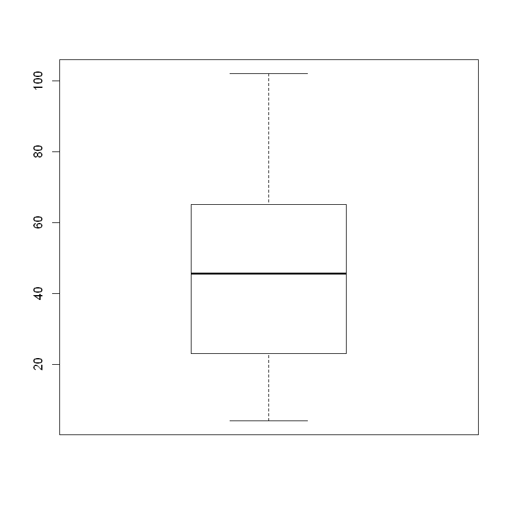
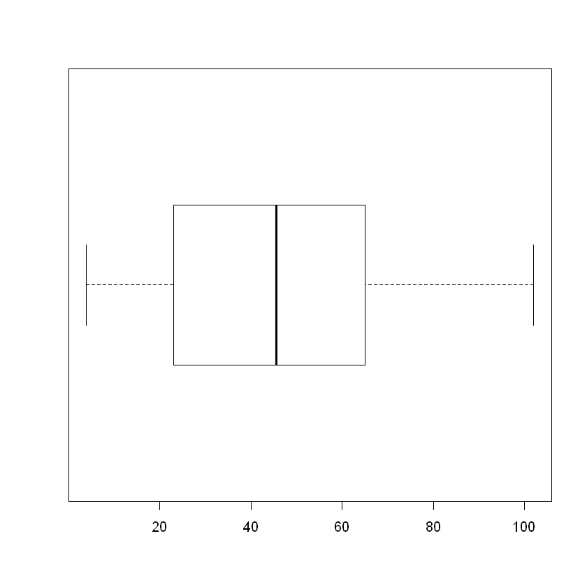
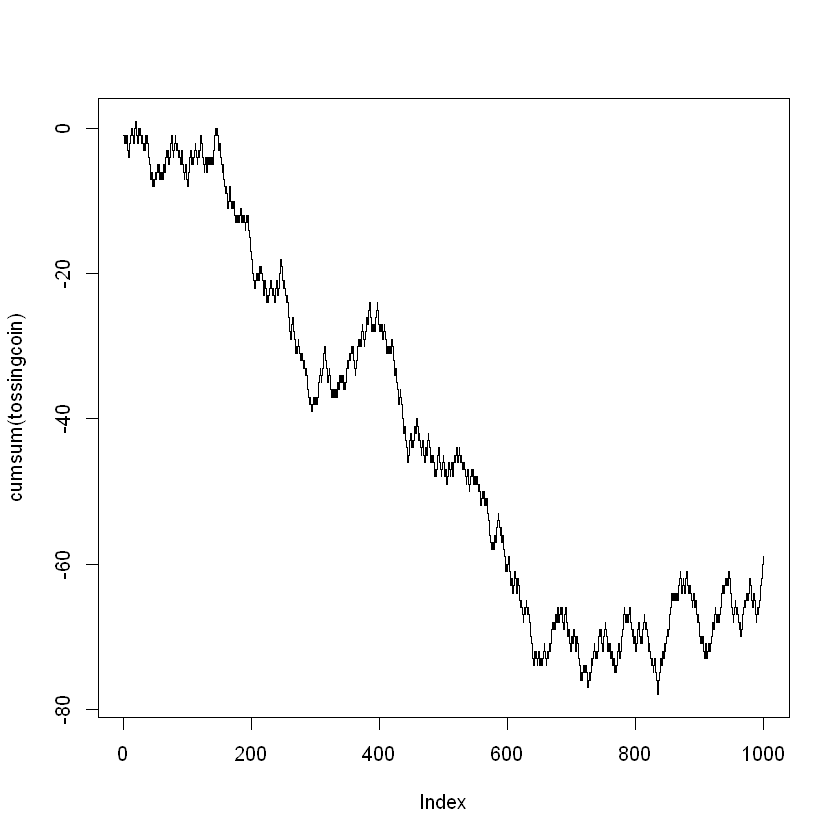
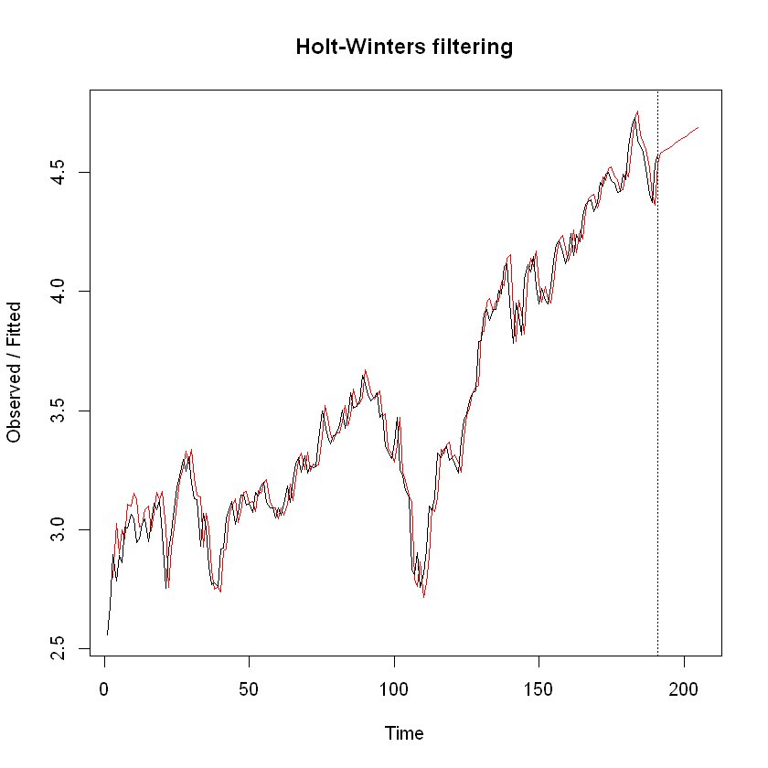
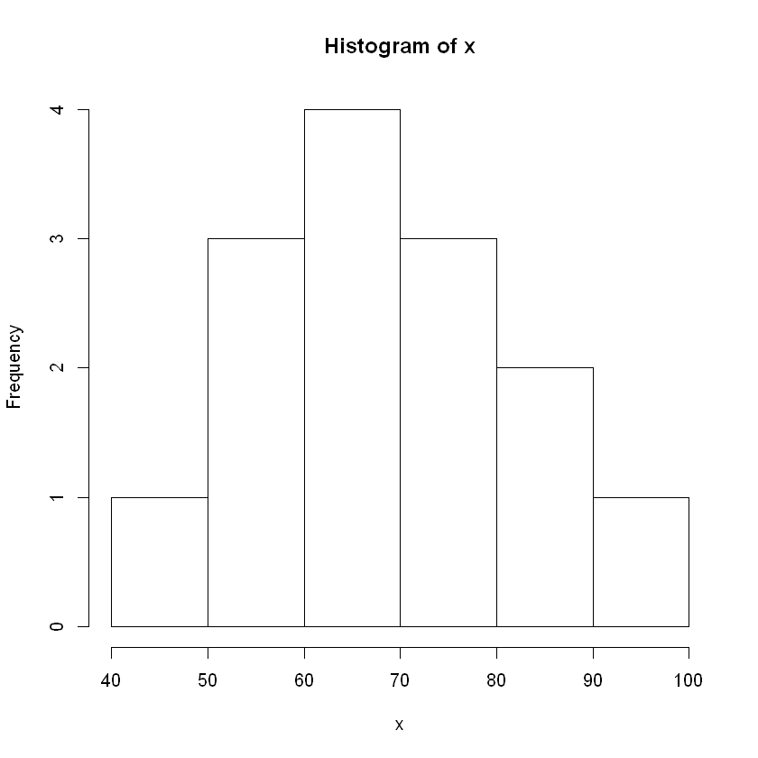
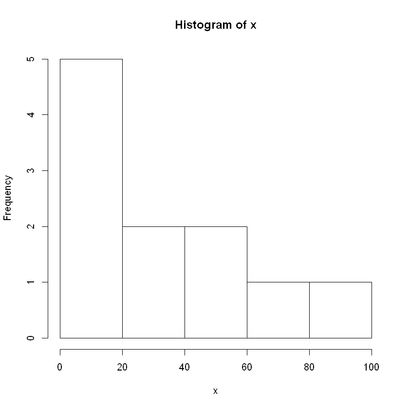
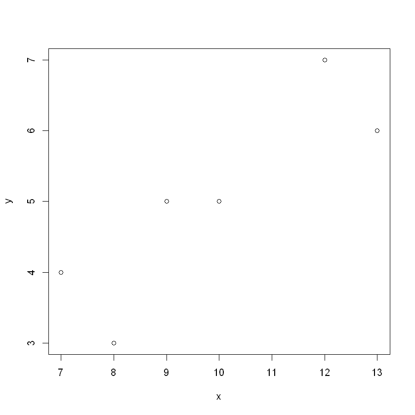

.. code:: r

    ################################
    # P(exactly 8)
    # P(x = 8)
    # dbinom(a,size=n,prob=p)
    dbinom(8, size=30, prob=.25)
    # P(less than 17)
    # P(x=0,1,2,...,16)
    # P(x <= 16
    # pbinom(a,size=n,prob=p)
    pbinom(16,size=30,prob=.25)
    # P(at most 12)
    # P(x=0,1,2,...,12)
    # P(x <= 12)
    # pbinom(a,size=n,prob=p)
    pbinom(12,size=30,prob=.25)
    

.. raw:: html

    0.15930918764035

.. raw:: html

    0.999784306173905

.. raw:: html

    0.978406359120145

.. code:: r

    ################################
    # P(more than 20)
    # P(x = 21, 22, 23, 24, 25, 26, 27, 28, 29, 30)
    # 1 - P(x=0,...,20)
    # P(x >= 21)
    # 1-pbinom(a-1,size=n,prob=p)
    1-pbinom(21-1,size=30,prob=.25)
    # P(at least 25)
    # P(x=25,26,27,28,29,30)
    # P(x >= 25)
    # 1-pbinom(a-1,size=n,prob=p)
    1-pbinom(25-1,size=30,prob=.25)

.. raw:: html

    2.81832537640803e-07

.. raw:: html

    3.20596882374957e-11

.. code:: r

    ################################
    # P(between 10 and 20 inclusive)
    # P(x=10,11,..,20)
    # P(10 <= x <= 20)
    # pbinom(b,size=n,prob=p)-pbinom(a-1,size=n,prob=p)
    pbinom(20,size=30,prob=.25)-pbinom(10-1,size=30,prob=.25)

.. raw:: html

    0.196593081217951

.. code:: r

    ################################
    E = .05
    clevel = .99
    atl = clevel + (1 - clevel)/2
    z = qnorm(atl)
    # part a
    phat = .23
    n = phat * (1 - phat) * (z/E)^2
    n

.. raw:: html

    470.016075216343

.. code:: r

    # part b
    n = 0.25 * (z/E)^2
    n
    E = .2
    sigma = 1.3
    clevel = .95
    atl = clevel + (1 - clevel)/2
    z = qnorm(atl)
    n = (z * sigma/E)^2
    n

.. raw:: html

    663.489660102121

.. raw:: html

    162.301635174327

.. code:: r

    ################################
    x1 = 200
    n1 = 1000
    x2 = 100
    n2 = 780
    clevel = .95
    atl = clevel + (1 - clevel)/2
    z = qnorm(atl)
    phat1 = x1/n1
    phat2 = x2/n2
    lb = (phat1 - phat2) - z * sqrt(phat1 * (1 - phat1)/n1 + phat2 *
                                      (1 - phat2)/n2)
    ub = (phat1 - phat2) + z * sqrt(phat1 * (1 - phat1)/n1 + phat2
                                    * (1 - phat2)/n2)
    lb
    ub

.. raw:: html

    0.0376614902726703

.. raw:: html

    0.105928253317073

.. code:: r

    ################################
    n = 25
    xbar = 20.2
    sigma = 2.1
    clevel = .95
    atl = clevel + (1 - clevel)/2
    z = qnorm(atl)
    lb = xbar - z * sigma/sqrt(n)
    ub = xbar + z * sigma/sqrt(n)
    lb
    ub

.. raw:: html

    19.3768151264932

.. raw:: html

    21.0231848735068

.. code:: r

    ################################
    n = 25
    xbar = 20.2
    s = 2.1
    clevel = .95
    atl = clevel + (1 - clevel)/2
    t = qt(atl,df=n-1)
    lb = xbar - t * s/sqrt(n)
    ub = xbar + t * s/sqrt(n)
    lb
    ub

.. raw:: html

    19.3331626041162

.. raw:: html

    21.0668373958838

.. code:: r

    ################################
    x = 50
    n = 200
    clevel = .95
    atl = clevel + (1 - clevel)/2
    z = qnorm(atl)
    phat = x/n
    lb = phat - z * sqrt(phat * (1-phat)/n)
    ub = phat + z * sqrt(phat * (1-phat)/n)
    lb
    ub

.. raw:: html

    0.189988604045559

.. raw:: html

    0.310011395954441

.. code:: r

    ################################
    n = 18
    s = 2.5
    clevel = .95
    atl = (1 - clevel)/2
    XL = qchisq(atl,df=n-1)
    atl = clevel + (1 - clevel)/2
    XR = qchisq(atl,df=n-1)
    lb = sqrt( (n-1) * s^2/XR)
    ub = sqrt( (n-1) * s^2/XL)
    lb
    ub

.. raw:: html

    1.87596898789809

.. raw:: html

    3.74785997538552

.. code:: r

    ################################
    n = 25
    s = 10.1
    clevel = .98
    atl = (1 - clevel)/2
    XL = qchisq(atl,df=n-1)
    atl = clevel + (1 - clevel)/2
    XR = qchisq(atl,df=n-1)
    lb = (n-1) * s^2/XR
    ub = (n-1) * s^2/XL
    lb
    ub

.. raw:: html

    56.9625464243958

.. raw:: html

    225.51201942914

.. code:: r

    ################################
    var1 = 20
    n1 = 21
    var2 = 31
    n2 = 16
    clevel = .95
    atl = (1 - clevel)/2
    FL = qf(atl,n1,n2)
    atl = clevel + (1 - clevel)/2
    FR = qf(atl,n1,n2)
    lb = (var1/var2) * (1/FR)
    ub = (var1/var2) * (1/FL)
    lb
    ub

.. raw:: html

    0.242080862029108

.. raw:: html

    1.61749612381827

.. code:: r

    ################################
    x <- c(0,1,2,3,4)
    prob <-
      c(0.20,0.30,0.25,0.15,0.10)
    expected_value = sum(x *
                           prob)
    expected_value

.. raw:: html

    1.65

.. code:: r

    ################################
    x <- c(0,1,2,3,4)
    prob <- c(0.20,0.30,0.25,0.15,0.10)
    mu = sum(x * prob)
    variance = sum((x-mu)^2*prob)
    sigma = sqrt(variance)
    sigma
    variance

.. raw:: html

    1.23592070943083

.. raw:: html

    1.5275

.. code:: r

    ################################
    x <- c(4,13,21,23,27,35,41,50,59,61,65,73,81,102)
    min(x)
    quantile(x,0.25)
    quantile(x,0.50)
    quantile(x,0.75)
    max(x)

.. raw:: html

    4

.. raw:: html

    <strong>25%:</strong> 24

.. raw:: html

    <strong>50%:</strong> 45.5

.. raw:: html

    <strong>75%:</strong> 64

.. raw:: html

    102

.. code:: r

    ################################
    x <- c(4,13,21,23,27,35,41,50,59,61,65,73,81,102)
    boxplot(x)

.. code:: r

    ################################
    x <- c(4,13,21,23,27,35,41,50,59,61,65,73,81,102)
    boxplot(x,horizontal=TRUE,outline=FALSE)

.. code:: r

    ################################
    bmw<-c(2.556606964, 2.67855273, 2.896409052, 2.783157674, 2.891704203,
           2.860542363, 3.010177438, 3.006078566, 3.065817881, 3.04599754,
           2.946331923, 2.959845995, 3.026358467, 3.04652044, 2.950368732,
           3.029070333, 3.110533089, 3.085024381, 3.119939077, 2.978535249,
           2.75219467,  2.915389521, 2.988153628, 3.086303972, 3.176594433,
           3.225732266, 3.294465556, 3.243529412, 3.304870018, 3.193147676, 3.129738553,
           3.127374383, 2.92905814, 3.068145954, 3.005435049, 2.843629495, 2.770085592,
           2.777451878, 2.759566804, 2.920092359, 2.92111648, 3.049652116, 3.082093439,
           3.116267075, 3.020815054, 3.067773826, 3.144712467, 3.145272341, 3.101892469,
           3.110666812, 3.072415498, 3.155850824, 3.14246983, 3.183704502, 3.198713933,
           3.113070766, 3.089495803, 3.090996998, 3.048798994, 3.092541329, 3.0610049,
           3.104945359, 3.18507082, 3.115690719, 3.207693535, 3.277106996, 3.30402547,
           3.241771702, 3.311746668, 3.23569361, 3.26617917, 3.258903904, 3.263772706,
           3.378303983, 3.497567605, 3.44470377, 3.389057322, 3.361797986, 3.395749234,
           3.396519792, 3.440065469, 3.503362798, 3.426215145, 3.469665671, 3.574197854,
           3.510470234, 3.516369605, 3.54208912, 3.649670741, 3.613670877, 3.567191931,
           3.540669427, 3.554004302, 3.575878715, 3.472742549, 3.488230981, 3.347761443,
           3.330774917, 3.297317251, 3.365535661, 3.471003256, 3.25091698, 3.224380646,
           3.163785859, 3.138099515, 2.833036858, 2.810907587, 2.904712875, 2.755251803,
           2.814689898, 2.913002626, 3.099236067, 3.078325572, 3.13366646, 3.322839365,
           3.302444616, 3.338754441, 3.349166974, 3.291345313, 3.303216973, 3.276465257,
           3.237776084, 3.375400827, 3.45817615, 3.488017074, 3.541857471, 3.572457991,
           3.581015808, 3.791774433, 3.79312685, 3.910581968, 3.926340026, 3.878135247,
           3.925156384, 3.924643037, 4.005057871, 3.99085267, 4.103485985, 4.118061089,
           3.903708536, 3.783462097, 3.950685871, 3.897132693, 3.81874476, 4.052497737,
           4.112446398, 4.083216204, 4.146161886, 4.01983651, 3.949145365, 4.014417126,
           3.961879268, 3.948779146, 4.0255481, 4.129615176, 4.196810894, 4.213400861,
           4.165765594, 4.11662777, 4.156520921, 4.241873366, 4.149384994, 4.240520672,
           4.208773832, 4.317394776, 4.367344376, 4.379586159, 4.387250467, 4.334240341,
           4.375203409, 4.459658747, 4.443815285, 4.494730125, 4.500465011, 4.464412748,
           4.456101571, 4.414856779, 4.418370618, 4.493210164, 4.469212996, 4.610565605,
           4.699352457, 4.72942998, 4.636349034, 4.6121458, 4.586802529, 4.514150788, 4.409398581,
           4.372228792, 4.536462988, 4.572233686) #logarithm of BMW stock price
    bmw2<-ts(bmw) #indicate that bmw is a time series variable
    hw<-HoltWinters(bmw2, gamma=FALSE) #implement Holt Winters method
    hw #obtain the estimated coefficients

.. parsed-literal::

    Holt-Winters exponential smoothing with trend and without seasonal component.
    
    Call:
    HoltWinters(x = bmw2, gamma = FALSE)
    
    Smoothing parameters:
     alpha: 0.9705391
     beta : 0.09581481
     gamma: FALSE
    
    Coefficients:
             [,1]
    a 4.571180897
    b 0.008494273

.. code:: r

    ################################
    tossingcoin <- sample(c(-1,1), 1000, replace = TRUE)
    cumsum(tossingcoin)
    plot(cumsum(tossingcoin), type = 's')

.. raw:: html

    <ol class=list-inline>
    	<li>-1</li>
    	<li>-2</li>
    	<li>-1</li>
    	<li>-2</li>
    	<li>-1</li>
    	<li>-2</li>
    	<li>-3</li>
    	<li>-4</li>
    	<li>-3</li>
    	<li>-2</li>
    	<li>-1</li>
    	<li>0</li>
    	<li>-1</li>
    	<li>0</li>
    	<li>-1</li>
    	<li>-2</li>
    	<li>-1</li>
    	<li>0</li>
    	<li>1</li>
    	<li>0</li>
    	<li>-1</li>
    	<li>-2</li>
    	<li>-1</li>
    	<li>0</li>
    	<li>-1</li>
    	<li>0</li>
    	<li>-1</li>
    	<li>-2</li>
    	<li>-1</li>
    	<li>-2</li>
    	<li>-3</li>
    	<li>-2</li>
    	<li>-3</li>
    	<li>-2</li>
    	<li>-1</li>
    	<li>-2</li>
    	<li>-1</li>
    	<li>-2</li>
    	<li>-3</li>
    	<li>-4</li>
    	<li>-5</li>
    	<li>-6</li>
    	<li>-7</li>
    	<li>-6</li>
    	<li>-7</li>
    	<li>-8</li>
    	<li>-7</li>
    	<li>-8</li>
    	<li>-7</li>
    	<li>-6</li>
    	<li>-7</li>
    	<li>-6</li>
    	<li>-5</li>
    	<li>-6</li>
    	<li>-5</li>
    	<li>-6</li>
    	<li>-7</li>
    	<li>-6</li>
    	<li>-7</li>
    	<li>-6</li>
    	<li>-7</li>
    	<li>-6</li>
    	<li>-5</li>
    	<li>-6</li>
    	<li>-5</li>
    	<li>-4</li>
    	<li>-3</li>
    	<li>-4</li>
    	<li>-3</li>
    	<li>-4</li>
    	<li>-5</li>
    	<li>-4</li>
    	<li>-3</li>
    	<li>-2</li>
    	<li>-1</li>
    	<li>-2</li>
    	<li>-3</li>
    	<li>-4</li>
    	<li>-3</li>
    	<li>-2</li>
    	<li>-1</li>
    	<li>-2</li>
    	<li>-3</li>
    	<li>-2</li>
    	<li>-3</li>
    	<li>-4</li>
    	<li>-3</li>
    	<li>-4</li>
    	<li>-5</li>
    	<li>-4</li>
    	<li>-3</li>
    	<li>-4</li>
    	<li>-5</li>
    	<li>-6</li>
    	<li>-7</li>
    	<li>-6</li>
    	<li>-5</li>
    	<li>-6</li>
    	<li>-7</li>
    	<li>-8</li>
    	<li>-7</li>
    	<li>-6</li>
    	<li>-5</li>
    	<li>-4</li>
    	<li>-3</li>
    	<li>-4</li>
    	<li>-5</li>
    	<li>-4</li>
    	<li>-5</li>
    	<li>-4</li>
    	<li>-3</li>
    	<li>-2</li>
    	<li>-3</li>
    	<li>-4</li>
    	<li>-5</li>
    	<li>-4</li>
    	<li>-3</li>
    	<li>-4</li>
    	<li>-3</li>
    	<li>-2</li>
    	<li>-1</li>
    	<li>-2</li>
    	<li>-3</li>
    	<li>-4</li>
    	<li>-5</li>
    	<li>-6</li>
    	<li>-5</li>
    	<li>-4</li>
    	<li>-5</li>
    	<li>-6</li>
    	<li>-5</li>
    	<li>-4</li>
    	<li>-5</li>
    	<li>-4</li>
    	<li>-5</li>
    	<li>-4</li>
    	<li>-5</li>
    	<li>-4</li>
    	<li>-5</li>
    	<li>-4</li>
    	<li>-3</li>
    	<li>-2</li>
    	<li>-1</li>
    	<li>0</li>
    	<li>-1</li>
    	<li>0</li>
    	<li>-1</li>
    	<li>-2</li>
    	<li>-3</li>
    	<li>-2</li>
    	<li>-3</li>
    	<li>-4</li>
    	<li>-5</li>
    	<li>-6</li>
    	<li>-5</li>
    	<li>-6</li>
    	<li>-7</li>
    	<li>-8</li>
    	<li>-9</li>
    	<li>-8</li>
    	<li>-9</li>
    	<li>-10</li>
    	<li>-11</li>
    	<li>-10</li>
    	<li>-9</li>
    	<li>-8</li>
    	<li>-9</li>
    	<li>-10</li>
    	<li>-11</li>
    	<li>-10</li>
    	<li>-11</li>
    	<li>-10</li>
    	<li>-11</li>
    	<li>-12</li>
    	<li>-13</li>
    	<li>-12</li>
    	<li>-13</li>
    	<li>-12</li>
    	<li>-13</li>
    	<li>-12</li>
    	<li>-13</li>
    	<li>-12</li>
    	<li>-11</li>
    	<li>-12</li>
    	<li>-13</li>
    	<li>-12</li>
    	<li>-13</li>
    	<li>-12</li>
    	<li>-13</li>
    	<li>-14</li>
    	<li>-13</li>
    	<li>-12</li>
    	<li>-13</li>
    	<li>-12</li>
    	<li>-13</li>
    	<li>-14</li>
    	<li>-15</li>
    	<li>-16</li>
    	<li>-17</li>
    	<li>-18</li>
    	<li>-19</li>
    	<li>-20</li>
    	<li>-21</li>
    	<li>-22</li>
    	<li>-21</li>
    	<li>-22</li>
    	<li>-21</li>
    	<li>-20</li>
    	<li>-21</li>
    	<li>-20</li>
    	<li>-21</li>
    	<li>-20</li>
    	<li>-19</li>
    	<li>-20</li>
    	<li>-19</li>
    	<li>-20</li>
    	<li>-21</li>
    	<li>-22</li>
    	<li>-23</li>
    	<li>-22</li>
    	<li>-21</li>
    	<li>-22</li>
    	<li>-23</li>
    	<li>-24</li>
    	<li>-23</li>
    	<li>-24</li>
    	<li>-23</li>
    	<li>-22</li>
    	<li>-21</li>
    	<li>-22</li>
    	<li>-21</li>
    	<li>-22</li>
    	<li>-23</li>
    	<li>-22</li>
    	<li>-23</li>
    	<li>-24</li>
    	<li>-23</li>
    	<li>-22</li>
    	<li>-21</li>
    	<li>-22</li>
    	<li>-23</li>
    	<li>-22</li>
    	<li>-21</li>
    	<li>-20</li>
    	<li>-19</li>
    	<li>-18</li>
    	<li>-19</li>
    	<li>-20</li>
    	<li>-21</li>
    	<li>-22</li>
    	<li>-21</li>
    	<li>-22</li>
    	<li>-23</li>
    	<li>-24</li>
    	<li>-23</li>
    	<li>-24</li>
    	<li>-25</li>
    	<li>-26</li>
    	<li>-27</li>
    	<li>-28</li>
    	<li>-29</li>
    	<li>-28</li>
    	<li>-27</li>
    	<li>-26</li>
    	<li>-27</li>
    	<li>-28</li>
    	<li>-29</li>
    	<li>-30</li>
    	<li>-31</li>
    	<li>-30</li>
    	<li>-31</li>
    	<li>-30</li>
    	<li>-29</li>
    	<li>-30</li>
    	<li>-31</li>
    	<li>-32</li>
    	<li>-31</li>
    	<li>-32</li>
    	<li>-31</li>
    	<li>-32</li>
    	<li>-33</li>
    	<li>-32</li>
    	<li>-33</li>
    	<li>-34</li>
    	<li>-33</li>
    	<li>-34</li>
    	<li>-35</li>
    	<li>-36</li>
    	<li>-37</li>
    	<li>-38</li>
    	<li>-37</li>
    	<li>-38</li>
    	<li>-39</li>
    	<li>-38</li>
    	<li>-39</li>
    	<li>-38</li>
    	<li>-37</li>
    	<li>-38</li>
    	<li>-37</li>
    	<li>-38</li>
    	<li>-37</li>
    	<li>-38</li>
    	<li>-37</li>
    	<li>-36</li>
    	<li>-35</li>
    	<li>-34</li>
    	<li>-33</li>
    	<li>-34</li>
    	<li>-35</li>
    	<li>-34</li>
    	<li>-33</li>
    	<li>-32</li>
    	<li>-31</li>
    	<li>-30</li>
    	<li>-31</li>
    	<li>-32</li>
    	<li>-33</li>
    	<li>-34</li>
    	<li>-35</li>
    	<li>-34</li>
    	<li>-33</li>
    	<li>-34</li>
    	<li>-35</li>
    	<li>-36</li>
    	<li>-37</li>
    	<li>-36</li>
    	<li>-37</li>
    	<li>-36</li>
    	<li>-37</li>
    	<li>-36</li>
    	<li>-37</li>
    	<li>-36</li>
    	<li>-37</li>
    	<li>-36</li>
    	<li>-35</li>
    	<li>-36</li>
    	<li>-35</li>
    	<li>-34</li>
    	<li>-35</li>
    	<li>-34</li>
    	<li>-35</li>
    	<li>-34</li>
    	<li>-35</li>
    	<li>-36</li>
    	<li>-35</li>
    	<li>-36</li>
    	<li>-35</li>
    	<li>-34</li>
    	<li>-33</li>
    	<li>-32</li>
    	<li>-33</li>
    	<li>-32</li>
    	<li>-31</li>
    	<li>-32</li>
    	<li>-31</li>
    	<li>-30</li>
    	<li>-31</li>
    	<li>-30</li>
    	<li>-31</li>
    	<li>-32</li>
    	<li>-33</li>
    	<li>-34</li>
    	<li>-33</li>
    	<li>-32</li>
    	<li>-31</li>
    	<li>-30</li>
    	<li>-29</li>
    	<li>-30</li>
    	<li>-29</li>
    	<li>-30</li>
    	<li>-29</li>
    	<li>-28</li>
    	<li>-27</li>
    	<li>-28</li>
    	<li>-29</li>
    	<li>-30</li>
    	<li>-29</li>
    	<li>-28</li>
    	<li>-27</li>
    	<li>-26</li>
    	<li>-27</li>
    	<li>-26</li>
    	<li>-25</li>
    	<li>-24</li>
    	<li>-25</li>
    	<li>-26</li>
    	<li>-27</li>
    	<li>-28</li>
    	<li>-27</li>
    	<li>-28</li>
    	<li>-27</li>
    	<li>-28</li>
    	<li>-27</li>
    	<li>-26</li>
    	<li>-25</li>
    	<li>-24</li>
    	<li>-25</li>
    	<li>-26</li>
    	<li>-27</li>
    	<li>-28</li>
    	<li>-27</li>
    	<li>-28</li>
    	<li>-27</li>
    	<li>-28</li>
    	<li>-29</li>
    	<li>-28</li>
    	<li>-27</li>
    	<li>-28</li>
    	<li>-29</li>
    	<li>-30</li>
    	<li>-31</li>
    	<li>-30</li>
    	<li>-31</li>
    	<li>-30</li>
    	<li>-31</li>
    	<li>-30</li>
    	<li>-31</li>
    	<li>-30</li>
    	<li>-29</li>
    	<li>-30</li>
    	<li>-31</li>
    	<li>-32</li>
    	<li>-33</li>
    	<li>-34</li>
    	<li>-33</li>
    	<li>-34</li>
    	<li>-35</li>
    	<li>-36</li>
    	<li>-37</li>
    	<li>-38</li>
    	<li>-37</li>
    	<li>-36</li>
    	<li>-37</li>
    	<li>-38</li>
    	<li>-39</li>
    	<li>-40</li>
    	<li>-41</li>
    	<li>-42</li>
    	<li>-41</li>
    	<li>-42</li>
    	<li>-43</li>
    	<li>-44</li>
    	<li>-45</li>
    	<li>-46</li>
    	<li>-45</li>
    	<li>-44</li>
    	<li>-43</li>
    	<li>-42</li>
    	<li>-43</li>
    	<li>-44</li>
    	<li>-43</li>
    	<li>-44</li>
    	<li>-43</li>
    	<li>-42</li>
    	<li>-41</li>
    	<li>-42</li>
    	<li>-41</li>
    	<li>-40</li>
    	<li>-41</li>
    	<li>-42</li>
    	<li>-43</li>
    	<li>-42</li>
    	<li>-43</li>
    	<li>-44</li>
    	<li>-45</li>
    	<li>-44</li>
    	<li>-43</li>
    	<li>-44</li>
    	<li>-45</li>
    	<li>-46</li>
    	<li>-45</li>
    	<li>-44</li>
    	<li>-45</li>
    	<li>-44</li>
    	<li>-43</li>
    	<li>-42</li>
    	<li>-43</li>
    	<li>-44</li>
    	<li>-45</li>
    	<li>-46</li>
    	<li>-45</li>
    	<li>-46</li>
    	<li>-45</li>
    	<li>-46</li>
    	<li>-47</li>
    	<li>-48</li>
    	<li>-47</li>
    	<li>-48</li>
    	<li>-47</li>
    	<li>-46</li>
    	<li>-45</li>
    	<li>-44</li>
    	<li>-45</li>
    	<li>-46</li>
    	<li>-47</li>
    	<li>-48</li>
    	<li>-47</li>
    	<li>-46</li>
    	<li>-45</li>
    	<li>-46</li>
    	<li>-47</li>
    	<li>-48</li>
    	<li>-47</li>
    	<li>-48</li>
    	<li>-49</li>
    	<li>-48</li>
    	<li>-47</li>
    	<li>-46</li>
    	<li>-47</li>
    	<li>-48</li>
    	<li>-47</li>
    	<li>-46</li>
    	<li>-47</li>
    	<li>-48</li>
    	<li>-47</li>
    	<li>-46</li>
    	<li>-45</li>
    	<li>-46</li>
    	<li>-45</li>
    	<li>-44</li>
    	<li>-45</li>
    	<li>-46</li>
    	<li>-45</li>
    	<li>-44</li>
    	<li>-45</li>
    	<li>-46</li>
    	<li>-45</li>
    	<li>-46</li>
    	<li>-47</li>
    	<li>-46</li>
    	<li>-47</li>
    	<li>-46</li>
    	<li>-47</li>
    	<li>-48</li>
    	<li>-49</li>
    	<li>-48</li>
    	<li>-47</li>
    	<li>-48</li>
    	<li>-49</li>
    	<li>-50</li>
    	<li>-49</li>
    	<li>-48</li>
    	<li>-47</li>
    	<li>-48</li>
    	<li>-47</li>
    	<li>-48</li>
    	<li>-49</li>
    	<li>-48</li>
    	<li>-49</li>
    	<li>-48</li>
    	<li>-49</li>
    	<li>-48</li>
    	<li>-49</li>
    	<li>-50</li>
    	<li>-49</li>
    	<li>-50</li>
    	<li>-51</li>
    	<li>-52</li>
    	<li>-51</li>
    	<li>-50</li>
    	<li>-51</li>
    	<li>-50</li>
    	<li>-51</li>
    	<li>-52</li>
    	<li>-51</li>
    	<li>-52</li>
    	<li>-51</li>
    	<li>-52</li>
    	<li>-53</li>
    	<li>-54</li>
    	<li>-55</li>
    	<li>-56</li>
    	<li>-57</li>
    	<li>-58</li>
    	<li>-57</li>
    	<li>-58</li>
    	<li>-57</li>
    	<li>-58</li>
    	<li>-57</li>
    	<li>-56</li>
    	<li>-57</li>
    	<li>-56</li>
    	<li>-55</li>
    	<li>-54</li>
    	<li>-53</li>
    	<li>-54</li>
    	<li>-55</li>
    	<li>-56</li>
    	<li>-55</li>
    	<li>-56</li>
    	<li>-57</li>
    	<li>-56</li>
    	<li>-57</li>
    	<li>-58</li>
    	<li>-59</li>
    	<li>-60</li>
    	<li>-61</li>
    	<li>-60</li>
    	<li>-61</li>
    	<li>-60</li>
    	<li>-59</li>
    	<li>-60</li>
    	<li>-61</li>
    	<li>-62</li>
    	<li>-63</li>
    	<li>-62</li>
    	<li>-63</li>
    	<li>-64</li>
    	<li>-63</li>
    	<li>-62</li>
    	<li>-61</li>
    	<li>-62</li>
    	<li>-63</li>
    	<li>-64</li>
    	<li>-63</li>
    	<li>-62</li>
    	<li>-63</li>
    	<li>-64</li>
    	<li>-65</li>
    	<li>-66</li>
    	<li>-65</li>
    	<li>-66</li>
    	<li>-67</li>
    	<li>-68</li>
    	<li>-67</li>
    	<li>-66</li>
    	<li>-67</li>
    	<li>-66</li>
    	<li>-65</li>
    	<li>-66</li>
    	<li>-67</li>
    	<li>-66</li>
    	<li>-67</li>
    	<li>-68</li>
    	<li>-69</li>
    	<li>-70</li>
    	<li>-71</li>
    	<li>-72</li>
    	<li>-73</li>
    	<li>-74</li>
    	<li>-73</li>
    	<li>-72</li>
    	<li>-73</li>
    	<li>-72</li>
    	<li>-73</li>
    	<li>-74</li>
    	<li>-73</li>
    	<li>-72</li>
    	<li>-73</li>
    	<li>-74</li>
    	<li>-73</li>
    	<li>-74</li>
    	<li>-73</li>
    	<li>-74</li>
    	<li>-73</li>
    	<li>-72</li>
    	<li>-71</li>
    	<li>-72</li>
    	<li>-73</li>
    	<li>-74</li>
    	<li>-73</li>
    	<li>-72</li>
    	<li>-73</li>
    	<li>-72</li>
    	<li>-71</li>
    	<li>-72</li>
    	<li>-71</li>
    	<li>-70</li>
    	<li>-69</li>
    	<li>-68</li>
    	<li>-69</li>
    	<li>-68</li>
    	<li>-69</li>
    	<li>-68</li>
    	<li>-67</li>
    	<li>-68</li>
    	<li>-67</li>
    	<li>-66</li>
    	<li>-67</li>
    	<li>-68</li>
    	<li>-67</li>
    	<li>-66</li>
    	<li>-67</li>
    	<li>-66</li>
    	<li>-67</li>
    	<li>-68</li>
    	<li>-69</li>
    	<li>-68</li>
    	<li>-67</li>
    	<li>-66</li>
    	<li>-67</li>
    	<li>-68</li>
    	<li>-69</li>
    	<li>-70</li>
    	<li>-69</li>
    	<li>-70</li>
    	<li>-71</li>
    	<li>-72</li>
    	<li>-71</li>
    	<li>-70</li>
    	<li>-71</li>
    	<li>-70</li>
    	<li>-69</li>
    	<li>-70</li>
    	<li>-71</li>
    	<li>-72</li>
    	<li>-71</li>
    	<li>-70</li>
    	<li>-71</li>
    	<li>-72</li>
    	<li>-73</li>
    	<li>-74</li>
    	<li>-75</li>
    	<li>-76</li>
    	<li>-75</li>
    	<li>-76</li>
    	<li>-75</li>
    	<li>-74</li>
    	<li>-75</li>
    	<li>-74</li>
    	<li>-75</li>
    	<li>-74</li>
    	<li>-75</li>
    	<li>-76</li>
    	<li>-77</li>
    	<li>-76</li>
    	<li>-75</li>
    	<li>-76</li>
    	<li>-75</li>
    	<li>-74</li>
    	<li>-73</li>
    	<li>-74</li>
    	<li>-73</li>
    	<li>-72</li>
    	<li>-71</li>
    	<li>-72</li>
    	<li>-73</li>
    	<li>-72</li>
    	<li>-73</li>
    	<li>-72</li>
    	<li>-71</li>
    	<li>-70</li>
    	<li>-69</li>
    	<li>-70</li>
    	<li>-69</li>
    	<li>-70</li>
    	<li>-71</li>
    	<li>-72</li>
    	<li>-71</li>
    	<li>-70</li>
    	<li>-69</li>
    	<li>-68</li>
    	<li>-69</li>
    	<li>-70</li>
    	<li>-71</li>
    	<li>-72</li>
    	<li>-71</li>
    	<li>-72</li>
    	<li>-71</li>
    	<li>-72</li>
    	<li>-73</li>
    	<li>-72</li>
    	<li>-73</li>
    	<li>-74</li>
    	<li>-73</li>
    	<li>-74</li>
    	<li>-75</li>
    	<li>-74</li>
    	<li>-75</li>
    	<li>-74</li>
    	<li>-73</li>
    	<li>-72</li>
    	<li>-71</li>
    	<li>-72</li>
    	<li>-73</li>
    	<li>-72</li>
    	<li>-71</li>
    	<li>-70</li>
    	<li>-69</li>
    	<li>-68</li>
    	<li>-67</li>
    	<li>-66</li>
    	<li>-67</li>
    	<li>-68</li>
    	<li>-67</li>
    	<li>-68</li>
    	<li>-67</li>
    	<li>-68</li>
    	<li>-67</li>
    	<li>-66</li>
    	<li>-67</li>
    	<li>-68</li>
    	<li>-69</li>
    	<li>-70</li>
    	<li>-69</li>
    	<li>-70</li>
    	<li>-71</li>
    	<li>-70</li>
    	<li>-71</li>
    	<li>-72</li>
    	<li>-71</li>
    	<li>-70</li>
    	<li>-69</li>
    	<li>-68</li>
    	<li>-69</li>
    	<li>-70</li>
    	<li>-71</li>
    	<li>-70</li>
    	<li>-71</li>
    	<li>-70</li>
    	<li>-69</li>
    	<li>-68</li>
    	<li>-67</li>
    	<li>-68</li>
    	<li>-69</li>
    	<li>-68</li>
    	<li>-69</li>
    	<li>-70</li>
    	<li>-71</li>
    	<li>-72</li>
    	<li>-71</li>
    	<li>-72</li>
    	<li>-73</li>
    	<li>-74</li>
    	<li>-73</li>
    	<li>-74</li>
    	<li>-75</li>
    	<li>-74</li>
    	<li>-73</li>
    	<li>-74</li>
    	<li>-75</li>
    	<li>-76</li>
    	<li>-77</li>
    	<li>-78</li>
    	<li>-77</li>
    	<li>-76</li>
    	<li>-75</li>
    	<li>-74</li>
    	<li>-73</li>
    	<li>-74</li>
    	<li>-73</li>
    	<li>-72</li>
    	<li>-73</li>
    	<li>-72</li>
    	<li>-71</li>
    	<li>-72</li>
    	<li>-71</li>
    	<li>-70</li>
    	<li>-69</li>
    	<li>-70</li>
    	<li>-69</li>
    	<li>-68</li>
    	<li>-67</li>
    	<li>-66</li>
    	<li>-65</li>
    	<li>-64</li>
    	<li>-65</li>
    	<li>-64</li>
    	<li>-65</li>
    	<li>-64</li>
    	<li>-65</li>
    	<li>-64</li>
    	<li>-65</li>
    	<li>-64</li>
    	<li>-65</li>
    	<li>-64</li>
    	<li>-63</li>
    	<li>-62</li>
    	<li>-61</li>
    	<li>-62</li>
    	<li>-63</li>
    	<li>-64</li>
    	<li>-63</li>
    	<li>-62</li>
    	<li>-63</li>
    	<li>-64</li>
    	<li>-63</li>
    	<li>-62</li>
    	<li>-61</li>
    	<li>-62</li>
    	<li>-63</li>
    	<li>-64</li>
    	<li>-63</li>
    	<li>-64</li>
    	<li>-63</li>
    	<li>-64</li>
    	<li>-65</li>
    	<li>-66</li>
    	<li>-65</li>
    	<li>-64</li>
    	<li>-65</li>
    	<li>-66</li>
    	<li>-65</li>
    	<li>-66</li>
    	<li>-67</li>
    	<li>-68</li>
    	<li>-67</li>
    	<li>-68</li>
    	<li>-69</li>
    	<li>-70</li>
    	<li>-71</li>
    	<li>-70</li>
    	<li>-71</li>
    	<li>-70</li>
    	<li>-71</li>
    	<li>-72</li>
    	<li>-73</li>
    	<li>-72</li>
    	<li>-71</li>
    	<li>-72</li>
    	<li>-73</li>
    	<li>-72</li>
    	<li>-71</li>
    	<li>-72</li>
    	<li>-71</li>
    	<li>-72</li>
    	<li>-71</li>
    	<li>-70</li>
    	<li>-69</li>
    	<li>-68</li>
    	<li>-69</li>
    	<li>-68</li>
    	<li>-67</li>
    	<li>-66</li>
    	<li>-67</li>
    	<li>-68</li>
    	<li>-67</li>
    	<li>-68</li>
    	<li>-67</li>
    	<li>-68</li>
    	<li>-67</li>
    	<li>-66</li>
    	<li>-65</li>
    	<li>-64</li>
    	<li>-63</li>
    	<li>-64</li>
    	<li>-63</li>
    	<li>-64</li>
    	<li>-63</li>
    	<li>-62</li>
    	<li>-63</li>
    	<li>-62</li>
    	<li>-63</li>
    	<li>-62</li>
    	<li>-61</li>
    	<li>-62</li>
    	<li>-63</li>
    	<li>-64</li>
    	<li>-65</li>
    	<li>-66</li>
    	<li>-67</li>
    	<li>-68</li>
    	<li>-67</li>
    	<li>-66</li>
    	<li>-65</li>
    	<li>-66</li>
    	<li>-67</li>
    	<li>-66</li>
    	<li>-67</li>
    	<li>-68</li>
    	<li>-69</li>
    	<li>-68</li>
    	<li>-69</li>
    	<li>-70</li>
    	<li>-69</li>
    	<li>-68</li>
    	<li>-67</li>
    	<li>-66</li>
    	<li>-65</li>
    	<li>-66</li>
    	<li>-65</li>
    	<li>-64</li>
    	<li>-65</li>
    	<li>-64</li>
    	<li>-65</li>
    	<li>-64</li>
    	<li>-63</li>
    	<li>-62</li>
    	<li>-63</li>
    	<li>-64</li>
    	<li>-65</li>
    	<li>-66</li>
    	<li>-65</li>
    	<li>-64</li>
    	<li>-65</li>
    	<li>-66</li>
    	<li>-67</li>
    	<li>-68</li>
    	<li>-67</li>
    	<li>-66</li>
    	<li>-67</li>
    	<li>-66</li>
    	<li>-65</li>
    	<li>-64</li>
    	<li>-63</li>
    	<li>-62</li>
    	<li>-61</li>
    	<li>-60</li>
    	<li>-59</li>
    	<li>-60</li>
    </ol>
    

.. code:: r

    ################################
    pred <- predict(hw, n.ahead = 14, prediction.interval = FALSE)
    #estimate the 14 predictions ahead
    pred #obtain the predictions
    plot(hw, pred) #obtain the graph
    #the red line shows the predicted values while the black line
    #indicates the stock price evolution

.. parsed-literal::

    Time Series:
    Start = 192 
    End = 205 
    Frequency = 1 
               fit
     [1,] 4.579675
     [2,] 4.588169
     [3,] 4.596664
     [4,] 4.605158
     [5,] 4.613652
     [6,] 4.622147
     [7,] 4.630641
     [8,] 4.639135
     [9,] 4.647629
    [10,] 4.656124
    [11,] 4.664618
    [12,] 4.673112
    [13,] 4.681606
    [14,] 4.690101

.. code:: r

    ################################
    alpha = 8
    beta = 1
    gamma = factorial(alpha - 1)
    a = 3
    b = 4
    f = function(x){(x^(alpha-1)*exp(-x/beta))/(beta ^ alpha *
                                                  gamma)}
    integrate(f,a,b)

.. parsed-literal::

    0.03922911 with absolute error < 4.4e-16

.. code:: r

    ################################
    observed <- c(200,150,350,20)
    prob <- c(0.25,0.20,0.50,0.05)
    chisq.test(observed,p=prob)

.. parsed-literal::

    
    	Chi-squared test for given probabilities
    
    data:  observed
    X-squared = 9.8611, df = 3, p-value = 0.01978
    

.. code:: r

    ################################
    x <- c(23, 27, 29, 35, 37, 37, 39, 40, 42, 45, 51)
    breaks = seq(20,60,by=10)
    xcut = cut(x,breaks,right=FALSE)
    freq = table(xcut)
    freq

.. parsed-literal::

    xcut
    [20,30) [30,40) [40,50) [50,60) 
          3       4       3       1 

.. code:: r

    ################################
    x <- c(1,2,8,13)
    y <- c(10,15,35,44)
    t_line = lm(y ~ x)
    t_line
    x <- c(3,5,7,9)
    y <- c(17,23,41,50)
    t_line = lm(y ~ x)
    t_line
    #form yhat = mx + b
    #form yhat = b1*x + b0
    coeffs = coefficients(t_line)
    b0 = coeffs[1]
    b1 = coeffs[2]
    b1 * 21 + b0

.. parsed-literal::

    
    Call:
    lm(formula = y ~ x)
    
    Coefficients:
    (Intercept)            x  
          8.894        2.851  
    

.. parsed-literal::

    
    Call:
    lm(formula = y ~ x)
    
    Coefficients:
    (Intercept)            x  
          -2.35         5.85  
    

.. raw:: html

    <strong>x:</strong> 120.5

.. code:: r

    ################################
    one <- c(1,1)
    xval <- c(1,2)
    yval <- c(2,5)
    X <- matrix(c(one,xval),nrow=2,ncol=2)
    Y <- matrix(c(yval),nrow=2,ncol=1)
    solve(t(X) %*% X) %*% t(X) %*% Y

.. raw:: html

    <table>
    <tbody>
    	<tr><td>-1</td></tr>
    	<tr><td> 3</td></tr>
    </tbody>
    </table>
    

.. code:: r

    ################################
    one <- c(1,1,1)
    x1val <- c(1,4,3)
    x2val <- c(2,-1,1)
    yval <- c(9,3,9)
    X <- matrix(c(one,x1val,x2val),nrow=3,ncol=3)
    Y <- matrix(c(yval),nrow=3,ncol=1)
    solve(t(X) %*% X) %*% t(X) %*% Y

.. raw:: html

    <table>
    <tbody>
    	<tr><td>-1</td></tr>
    	<tr><td> 2</td></tr>
    	<tr><td> 4</td></tr>
    </tbody>
    </table>
    

.. code:: r

    ################################
    one <- c(1,1,1)
    xval <- c(1,2,3)
    yval <- c(2,5,4)
    X <- matrix(c(one,xval),nrow=3,ncol=2)
    Y <- matrix(c(yval),nrow=3,ncol=1)
    betahat = solve(t(X) %*% X) %*% t(X) %*% Y
    betahat
    SSE = t(Y) %*% Y - t(betahat) %*% t(X) %*% Y
    SSE

.. raw:: html

    <table>
    <tbody>
    	<tr><td>1.666667</td></tr>
    	<tr><td>1.000000</td></tr>
    </tbody>
    </table>
    

.. raw:: html

    <table>
    <tbody>
    	<tr><td>2.666667</td></tr>
    </tbody>
    </table>
    

.. code:: r

    
    ################################
    x <- c(3,5,7,9)
    y <- c(17,23,41,50)
    t_line = lm(y ~ x)
    coeffs = coefficients(t_line)
    b0 = coeffs[1]
    b1 = coeffs[2]
    # form: yhat = b1(x) + b0
    yhat = b1 * x + b0
    # (y - yhat)^2 and then sum them
    sum((y-yhat)^2)

.. raw:: html

    24.3

.. code:: r

    ################################
    x <- c(40,51,53,55,65,67,69,70,72,75,76,81,83,99)
    hist(x)

.. code:: r

    ################################
    lcl <- c(10,20,30,40)
    ucl <- c(19,29,39,49)
    midpoints = (lcl + ucl)/2
    midpoints

.. raw:: html

    <ol class=list-inline>
    	<li>14.5</li>
    	<li>24.5</li>
    	<li>34.5</li>
    	<li>44.5</li>
    </ol>
    

.. code:: r

    ################################
    lcl <- c(10,20,30,40)
    ucl <- c(19,29,39,49)
    new_midpoints <- c()
    for (i in 1:length(lcl))
    {
      new_midpoints[i] = (lcl[i] + ucl[i])/2
    }
    new_midpoints

.. raw:: html

    <ol class=list-inline>
    	<li>14.5</li>
    	<li>24.5</li>
    	<li>34.5</li>
    	<li>44.5</li>
    </ol>
    

.. code:: r

    ################################
    lcl <- c(10,20,30,40)
    ucl <- c(19,29,39,49)
    f <- c(5,31,12,2)
    x = (lcl+ucl)/2
    xbar = sum(f * x)/sum(f)
    xbar

.. raw:: html

    26.7

.. code:: r

    ################################
    lcl <- c(10,20,30,40)
    ucl <- c(19,29,39,49)
    f <- c(5,31,12,2)
    x <- c()

.. code:: r

    ################################
    # create the midpoints
    for (i in 1:length(lcl))
    {
      x[i] = (lcl[i] + ucl[i])/2
    }
    sum_freq = 0
    sum_ftimesx = 0
    for (i in 1:length(lcl))
    {
      sum_freq = sum_freq + f[i]
      sum_ftimesx = sum_ftimesx + f[i] * x[i]
    }
    xbar = sum_ftimesx/sum_freq
    print(xbar)

.. parsed-literal::

    [1] 26.7
    

.. code:: r

    ################################
    lcl <- c(10,20,30,40)
    ucl <- c(19,29,39,49)
    f <- c(5,31,12,2)
    x <- (lcl + ucl)/2
    mean = sum(f * x)/sum(f)
    mean
    top_sum = sum((x - mean)^2 * f)
    sample_stdev = sqrt(top_sum/(sum(f) - 1))
    sample_stdev

.. raw:: html

    26.7

.. raw:: html

    6.78834535458098

.. code:: r

    ################################
    lcl <- c(10,20,30,40)
    ucl <- c(19,29,39,49)
    f <- c(5,31,12,2)
    x <- (lcl + ucl)/2
    mean = sum(f * x)/sum(f)
    mean
    top_sum = sum((x - mean)^2 * f)
    pop_stdev = sqrt(top_sum/sum(f))
    pop_stdev

.. raw:: html

    26.7

.. raw:: html

    6.72011904656458

.. code:: r

    ################################
    lcl <- c(10,20,30,40)
    ucl <- c(19,29,39,49)
    f <- c(5,31,12,2)
    x <- (lcl + ucl)/2
    mean = sum(f * x)/sum(f)
    mean
    top_sum = sum((x - mean)^2 * f)
    pop_stdev = sqrt(top_sum/sum(f))
    pop_stdev
    pop_variance = pop_stdev^2
    pop_variance

.. raw:: html

    26.7

.. raw:: html

    6.72011904656458

.. raw:: html

    45.16

.. code:: r

    ################################
    weights <- c(0.10,0.20,0.50,0.20)
    grades <- c(100,80,70,30)
    course_average = sum(weights * grades)/sum(weights)
    course_average
    ################################
    weights <- c(10,20,50,20)
    grades <- c(100,80,70,30)
    course_average = sum(weights * grades)/sum(weights)
    course_average

.. raw:: html

    67

.. raw:: html

    67

.. code:: r

    ################################
    x <- c(2, 5, 7, 11, 12, 21, 25, 31, 45, 72, 81, 102)
    quantile(x,0.25)
    quantile(x,0.50)
    quantile(x,0.75)

.. raw:: html

    <strong>25%:</strong> 10

.. raw:: html

    <strong>50%:</strong> 23

.. raw:: html

    <strong>75%:</strong> 51.75

.. code:: r

    ################################
    x <- c(25,2,31,12)
    newx = sort(x)
    newx

.. raw:: html

    <ol class=list-inline>
    	<li>2</li>
    	<li>12</li>
    	<li>25</li>
    	<li>31</li>
    </ol>
    

.. code:: r

    ################################
    x <- c(3.5, 3.2, 4.1, 4.7, 3.8, 5.1, 7.2, 3.9, 5.3, 6.1, 6.2, 3.1, 9.3,
           9.4, 10.5, 10.9, 11.1, 11.2, 12.7, 12.8, 13.1, 13.5, 17, 38.6)
    q1 = quantile(x,0.25)
    q3 = quantile(x,0.75)
    iqr = q3 - q1
    lf = q1 - 1.5 * iqr
    uf = q3 + 1.5 * iqr
    lf
    uf
    

.. raw:: html

    <strong>25%:</strong> -5.9875

.. raw:: html

    <strong>75%:</strong> 22.1125

.. code:: r

    ################################
    x <- c(20, 31, 42, 51, 55, 57, 60, 65, 70, 80)
    range = max(x) - min(x)
    range

.. raw:: html

    60

.. code:: r

    
    ################################
    x <- c(2,8,20,50)
    tsum = sum((x-mean(x))^2)
    pop_stdev = sqrt(tsum/length(x))
    pop_stdev

.. raw:: html

    18.4932420089069

.. code:: r

    ################################
    x <- c(2,8,20,50)
    # find the mean
    tsum = 0
    for (i in 1:length(x))
    {
      tsum = tsum + x[i]
    }
    mean = tsum/length(x)
    # calculate sum of (x-mean)^2
    newsum = 0
    for (i in 1:length(x))
    {
      newsum = newsum + (x[i] - mean)^2
    }
    # find population standard deviation
    pop_stdev = sqrt(newsum/length(x))
    pop_stdev

.. raw:: html

    18.4932420089069

.. code:: r

    ################################
    x <- c(2,8,20,50)
    sd(x)

.. raw:: html

    21.3541565040626

.. code:: r

    
    ################################
    x <- c(2,8,20,50)
    sample_variance = sd(x)^2
    sample_variance

.. raw:: html

    456

.. code:: r

    ################################
    x <- c(2,8,20,50)
    tsum = sum((x-mean(x))^2)
    pop_stdev = sqrt(tsum/length(x))
    pop_variance = pop_stdev^2
    pop_variance

.. raw:: html

    342

.. code:: r

    ################################
    x <- c(2, 8, 12, 13, 21, 32, 45, 51, 72, 81)
    tsum = sum((x-mean(x))^2)
    pop_stdev = sqrt(tsum/length(x))
    pop_mean = mean(x)
    CV = pop_stdev/pop_mean * 100
    CV

.. raw:: html

    77.7204528415696

.. code:: r

    ################################
    x <- c(2, 8, 12, 13, 21, 32, 45, 51, 72, 81)
    tsum = sum((x-mean(x))^2)
    pop_stdev = sqrt(tsum/length(x))
    pop_mean = mean(x)
    pop_median = median(x)
    sk = (3 * (pop_mean - pop_median))/pop_stdev
    sk

.. raw:: html

    0.824685821379213

.. code:: r

    ################################
    x <- c(1, 2, 8, 12, 13, 21, 32, 45, 51, 72, 81)
    tsum = sum((x-mean(x))^2)
    pop_stdev = sqrt(tsum/length(x))
    pop_mean = mean(x)
    pop_median = median(x)
    sk = (3 * (pop_mean - pop_median))/pop_stdev
    sk
    hist(x)

.. raw:: html

    1.0936221794622

.. code:: r

    ################################
    startval = 10
    endval = 20
    x <- c(2,12,15,31,32,45,58)
    count = 0
    for (i in 1:length(x))
    {
      if (x[i] >= startval && x[i] <= endval)
        count = count + 1
    }
    actualp = count/length(x) * 100
    actualp

.. raw:: html

    28.5714285714286

.. code:: r

    ################################
    n = 500
    p = .20
    # P(x is less than 90)
    # P(x <= 89.5)
    # case 1
    pnorm(89.5,mean=n*p,sd=sqrt(n*p*(1-p)),lower.tail=TRUE)
    # P(x is at most 92)
    # P(x <= 92.5)
    # case 1
    pnorm(92.5,mean=n*p,sd=sqrt(n*p*(1-p)),lower.tail=TRUE)
    # P(x is more than 105)
    # P(x >= 105.5)
    pnorm(105.5,mean=n*p,sd=sqrt(n*p*(1-p)),lower.tail=FALSE)
    # P(x is at least 100)
    # P(x >= 99.5)
    pnorm(99.5,mean=n*p,sd=sqrt(n*p*(1-p)),lower.tail=FALSE)
    # P(between 90 and 98, inclusive)
    # P(89.5 <= x <= 98.5)
    pnorm(98.5,mean=n*p,sd=sqrt(n*p*(1-p)),lower.tail=TRUE)-
      pnorm(89.5,mean=n*p,sd=sqrt(n*p*(1-p)),lower.tail=TRUE)

.. raw:: html

    0.120210393184218

.. raw:: html

    0.200867818527699

.. raw:: html

    0.269304208340612

.. raw:: html

    0.522289941503218

.. raw:: html

    0.313197249379494

.. code:: r

    ################################
    # P(exactly 8)
    # P(x = 8)
    # dpois(a,lambda=lam)
    a = 3
    t = 5
    lam = a * t
    dpois(8,lambda=lam)
    # P(less than 17)
    # P(x=0,1,2,...16)
    # P(x <= 16)
    # ppois(a,lambda=lam,lower=TRUE)
    ppois(16,lambda=lam,lower=TRUE)
    # P(at most 12)
    # P(x=0,1,2,...,12)
    # P(x <= 12)
    # ppois(a,lamba=lam,lower=TRUE)
    ppois(12,lambda=lam,lower=TRUE)
    # P(more than 20)
    # P(x=21,22,23,...)
    # P(x >= 21)
    # ppois(a,lambda=lam,lower=FALSE)
    ppois(21,lambda=lam,lower=FALSE)
    # P(at least 25)
    # P(x=25,26,27,...)
    # P(x >= 25)
    # ppois(a,lambda=lam,lower=FALSE)
    ppois(25,lambda=lam,lower=FALSE)

.. raw:: html

    0.0194443003318422

.. raw:: html

    0.664123200606545

.. raw:: html

    0.267611033392577

.. raw:: html

    0.0531064064592713

.. raw:: html

    0.00618490381126678

.. code:: r

    ################################
    f = function(x){1/x}
    integrate(f,1,5)

.. parsed-literal::

    1.609438 with absolute error < 3.7e-09

.. code:: r

    
    ################################
    f = function(x){1/x^2}
    integrate(f,1,Inf)
    ################################
    f = function(x){1/x^3}
    integrate(f,-Inf,Inf)

.. parsed-literal::

    1 with absolute error < 1.1e-14

.. parsed-literal::

    0 with absolute error < 0

.. code:: r

    ################################
    datavalues <- matrix(c(42,20,14,50,24,18,10,16,6),ncol=3,byrow=TRUE)
    colnames(datavalues) <- c("Approve","Disapprove","No_Opinion")
    rownames(datavalues) <- c("Republican","Democrat","Independent")
    tbl <- as.table(datavalues)
    chisq.test(tbl)

.. parsed-literal::

    
    	Pearson's Chi-squared test
    
    data:  tbl
    X-squared = 8.0305, df = 4, p-value = 0.09047
    

.. code:: r

    ################################
    datavalues <- matrix(c(25,35,75,45,30,45,45,15),ncol=4,byrow=TRUE)
    colnames(datavalues) <- c("0-30","30-60","60-90","90-over")
    rownames(datavalues) <- c("male","female")
    tbl <- as.table(datavalues)
    chisq.test(tbl)

.. parsed-literal::

    
    	Pearson's Chi-squared test
    
    data:  tbl
    X-squared = 18.146, df = 3, p-value = 0.0004103
    

.. code:: r

    ################################
    x <- c(7,12,10,9,13,8)
    y <- c(4,7,5,5,6,3)
    plot(x,y)

.. code:: r

    ################################
    x <- c(2,3,5,5,6)
    y <- c(1.3,1.6,2.1,2.2,2.7)
    cor(x,y)
    ################################
    x <- c(10,11,16,9,7,15,16,10)
    y <- c(96,51,62,58,89,81,46,51)
    cor(x,y)

.. raw:: html

    0.982703641586785

.. raw:: html

    -0.335057535329579

.. code:: r

    ################################
    pnorm(9.1,mean=10,sd=1.5/sqrt(20),lower.tail=TRUE)-
      pnorm(4.5,mean=10,sd=1.5/sqrt(20),lower.tail=TRUE)
    ################################
    pnorm(7500,mean=7200,sd=1200/sqrt(30))-pnorm(7000,mean=7200,sd=1200/sqrt(30))

.. raw:: html

    0.00364517904576781

.. raw:: html

    0.733893025621512

.. code:: r

    ################################
    alpha = 0.05
    pknot = 0.25
    n = 300
    truep = 0.22
    ZAL = qnorm(alpha)
    phatL = pknot + ZAL * sqrt(pknot * (1-pknot) / n)
    ZL = (phatL - truep) / sqrt(truep * (1-truep) / n)
    1-pnorm(ZL)
    pnorm(ZL)

.. raw:: html

    0.679036639899256

.. raw:: html

    0.320963360100744

.. code:: r

    ################################
    f = expression(x^2/(x-1),'x')
    D(f,'x')
    ################################
    f = function(x){2*(1-2*x^3)}
    integrate(f,1/4,3/8)

.. parsed-literal::

    2 * x/(x - 1) - x^2/(x - 1)^2

.. parsed-literal::

    0.2341309 with absolute error < 2.6e-15

.. code:: r

    ################################
    a = 3
    t = 5
    lam = a * t
    dpois(12,lambda=lam)
    ################################
    a = 8
    t = 3
    lam = a * t
    ppois(21,lambda=lam,lower=FALSE)

.. raw:: html

    0.0828592343686454

.. raw:: html

    0.686071971901457

.. code:: r

    ################################
    a = 8
    t = 3
    lam = a * t
    ppois(21,lambda=lam,lower=TRUE)-ppois(18-1,lambda=lam,lower=TRUE)

.. raw:: html

    0.226801591920095

.. code:: r

    ################################
    a = 0.01
    t = 100
    lam = a * t
    ppois(2-1,lambda=lam,lower=FALSE)

.. raw:: html

    0.264241117657115

.. code:: r

    ################################
    a = 4
    t = 1
    lam = a * t
    dpois(7,lambda=lam)^3

.. raw:: html

    0.000211073847054545

.. code:: r

    ################################
    pnorm(22,mean=25,sd=3.1,lower.tail=FALSE)
    mu=25
    sigma=3.1
    f = function(x){exp(-1 * (x - mu)^2 / (2*sigma^2)) / (sigma * sqrt(2 * pi))}
    integrate(f,22,Inf)

.. raw:: html

    0.833413365520525

.. parsed-literal::

    0.8334134 with absolute error < 2.2e-06

.. code:: r

    ################################
    pnorm(24.3,mean=25,sd=3.1,lower.tail=TRUE)- pnorm(18,mean=25,sd=3.1,lower.tail=TRUE)
    mu=25
    sigma=3.1
    f = function(x){exp(-1 * (x - mu)^2 / (2*sigma^2)) / (sigma * sqrt(2 * pi))}
    integrate(f,18,24.3)

.. raw:: html

    0.398705160765656

.. parsed-literal::

    0.3987052 with absolute error < 4.4e-15

.. code:: r

    ################################
    pnorm(7.5,mean=6.5,sd=1,lower.tail=TRUE)-pnorm(5,mean=6.5,sd=1,lower.tail=TRUE)
    ################################
    pnorm(1.75,mean=0,sd=1,lower.tail=TRUE)- pnorm(0.23,mean=0,sd=1,lower.tail=TRUE)
    ################################
    qnorm(0.05,mean=25,sd=3.1,lower.tail=TRUE)
    qnorm(0.95,mean=25,sd=3.1,lower.tail=TRUE)

.. raw:: html

    0.774537544799685

.. raw:: html

    0.368986727994177

.. raw:: html

    19.9009537564504

.. raw:: html

    30.0990462435496

.. code:: r

    ################################
    n = 100
    p = .20
    pnorm(18.5,mean=n*p,sd=sqrt(n*p*(1-p)),lower.tail=TRUE)
    ################################
    n = 100
    p = .20
    pnorm(20.5,mean=n*p,sd=sqrt(n*p*(1-p)),lower.tail=TRUE)

.. raw:: html

    0.353830233327276

.. raw:: html

    0.549738224830113

.. code:: r

    ################################
    n = 100
    p = .20
    pnorm(17.5,mean=n*p,sd=sqrt(n*p*(1-p)),lower.tail=FALSE)

.. raw:: html

    0.734014470951299

.. code:: r

    ################################
    n = 100
    p = .20
    pnorm(20.5,mean=n*p,sd=sqrt(n*p*(1-p)),lower.tail=TRUE)-
      pnorm(19.5,mean=n*p,sd=sqrt(n*p*(1-p)),lower.tail=TRUE)

.. raw:: html

    0.0994764496602258

.. code:: r

    ################################
    n = 100
    p = .60
    pnorm(69.5,mean=n*p,sd=sqrt(n*p*(1-p)),lower.tail=TRUE)

.. raw:: html

    0.973760250220377

.. code:: r

    ################################
    n = 100
    p = .50
    pnorm(54.5,mean=n*p,sd=sqrt(n*p*(1-p)),lower.tail=FALSE)

.. raw:: html

    0.18406012534676

.. code:: r

    ################################
    n = 1000
    p = .01
    pnorm(4.5,mean=n*p,sd=sqrt(n*p*(1-p)),lower.tail=FALSE)

.. raw:: html

    0.959769263059912

.. code:: r

    ################################
    n = 50
    p = 0.30
    pnorm(5.5,mean=n*p,sd=sqrt(n*p*(1-p)),lower.tail=TRUE)-pnorm(4.5,mean=n*p,sd=sqrt(n*p*(1-p)),lower.tail=TRUE)

.. raw:: html

    0.00108834300126286

.. code:: r

    ################################
    x <- c(84.98,87.72,86.82,87.53,88.63,88.51,88.3,86.64,86.69,86.77,87.38,86.61,89.31,90.02,89.35,90.47,88.6,86.31,85.65,85.9)
    mx = mean(x)
    msum = sum((x-mean(x))^2)
    pop_std = sqrt(msum/length(x))
    pop_std ^2

.. raw:: html

    2.13864474999999

.. code:: r

    ################################
    x<-c(2,8,13,25,32,40,42,43,45,57,63)
    mx = mean(x)
    mstd = sd(x)
    cv = mstd / mx * 100
    cv

.. raw:: html

    58.6855034283337

.. code:: r

    ################################
    x <- c(8, 19, 25, 31, 33, 47, 512, 803, 20000)
    mx = mean(x)
    medx = median(x)
    mstd = sd(x)
    skewness = (3 * (mx - medx)) / mstd
    skewness

.. raw:: html

    1.06794669775228

.. code:: r

    ################################
    x = 28.2
    mean = 30
    stdev = 2
    zscore = (x - mean) / stdev
    zscore

.. raw:: html

    -0.9

.. code:: r

    ################################
    print("Statistics")
    print("----------")
    x = 66
    mean = 79
    stdev = 4.5
    zscore = (x - mean) / stdev
    zscore
    print("Calculus")
    print("--------")
    x = 81
    mean = 69
    stdev = 3.7
    zscore = (x - mean) / stdev
    zscore

.. parsed-literal::

    [1] "Statistics"
    [1] "----------"
    

.. raw:: html

    -2.88888888888889

.. parsed-literal::

    [1] "Calculus"
    [1] "--------"
    

.. raw:: html

    3.24324324324324

.. code:: r

    ################################
    print("Geography")
    print("----------")
    x = 56
    mean = 80
    stdev = 20
    zscore = (x - mean) / stdev
    zscore
    print("Mathematics")
    print("-----------")
    x = 285
    mean = 300
    stdev = 10
    zscore = (x - mean) / stdev
    zscore

.. parsed-literal::

    [1] "Geography"
    [1] "----------"
    

.. raw:: html

    -1.2

.. parsed-literal::

    [1] "Mathematics"
    [1] "-----------"
    

.. raw:: html

    -1.5

.. code:: r

    ################################
    x <- c(3, 12, 17, 23, 27, 31, 45, 72, 81, 113, 152, 171, 189)
    quantile(x,0.25)
    quantile(x,0.50)
    quantile(x,0.75)

.. raw:: html

    <strong>25%:</strong> 23

.. raw:: html

    <strong>50%:</strong> 45

.. raw:: html

    <strong>75%:</strong> 113

.. code:: r

    ################################
    x <- c(68,73,66,76,86,74,61,89,65,90,69,92,76,62,81,63,68,81,70,73,60,87,75,64,82)
    quantile(x,0.25)

.. raw:: html

    <strong>25%:</strong> 66

.. code:: r

    ################################
    x <- c(1, 25, 33, 41, 42, 45, 51, 67, 88, 91, 105, 231, 405)
    q1 = quantile(x,0.25)
    q3 = quantile(x,0.75)
    iqr = q3 - q1
    iqr

.. raw:: html

    <strong>75%:</strong> 50

.. code:: r

    ################################
    x <- c(0.05, 0.00, -0.03, -0.01, 0.18, 0.00, 0.02, 0.29, 0.00, -0.07, 0.10, 0.07, 0.03)
    q1 = quantile(x,0.25)
    q3 = quantile(x,0.75)
    iqr = q3 - q1
    lf = q1 - 1.5 * iqr
    uf = q3 + 1.5 * iqr
    lf
    uf
    ################################
    q1 = quantile(x,0.25)
    q3 = quantile(x,0.75)
    iqr = q3 - q1
    lf = q1 - 1.5 * iqr
    uf = q3 + 1.5 * iqr
    lf
    uf

.. raw:: html

    <strong>25%:</strong> -0.105

.. raw:: html

    <strong>75%:</strong> 0.175

.. raw:: html

    <strong>25%:</strong> -0.105

.. raw:: html

    <strong>75%:</strong> 0.175

.. code:: r

    ################################
    one <- c(1,1,1,1)
    xval <- c(1,2,3,4)
    yval <- c(-8,-1,5,12)
    X <- matrix(c(one,xval),nrow=4,ncol=2)
    Y <- matrix(c(yval),nrow=4,ncol=1)
    solve(t(X) %*% X) %*% t(X) %*% Y

.. raw:: html

    <table>
    <tbody>
    	<tr><td>-14.5</td></tr>
    	<tr><td>  6.6</td></tr>
    </tbody>
    </table>
    

.. code:: r

    ################################
    one <- c(1,1,1,1)
    x1val <- c(1,2,3,4)
    x2val <- c(5,7,11,21)
    yval <- c(12,17,21,30)
    X <- matrix(c(one,x1val,x2val),nrow=4,ncol=3)
    Y <- matrix(c(yval),nrow=4,ncol=1)
    solve(t(X) %*% X) %*% t(X) %*% Y

.. raw:: html

    <table>
    <tbody>
    	<tr><td>6.595238</td></tr>
    	<tr><td>2.952381</td></tr>
    	<tr><td>0.547619</td></tr>
    </tbody>
    </table>
    

.. code:: r

    ################################
    one <- c(1,1,1,1,1,1,1)
    xval <- c(-3,-2,-1,0,1,2,3)
    yval <- c(-5,-1,0,2,-3,-8,-7)
    xsquared = xval^2
    X <- matrix(c(one,xval,xsquared),nrow=7,ncol=3)
    Y <- matrix(c(yval),nrow=7,ncol=1)
    solve(t(X) %*% X) %*% t(X) %*% Y

.. raw:: html

    <table>
    <tbody>
    	<tr><td>-0.3333333</td></tr>
    	<tr><td>-0.8214286</td></tr>
    	<tr><td>-0.7023810</td></tr>
    </tbody>
    </table>
    

.. code:: r

    ################################
    # "right tail"
    n1 = 61
    s1 = 34.4
    n2 = 31
    s2 = 27.6
    df1 = n1 - 1
    df2 = n2 - 1
    ts = s1^2 / s2^2
    # 'right tail'
    pf(ts,df1,df2,lower.tail=FALSE)

.. raw:: html

    0.0947487120743712

.. code:: r

    ################################
    n1 = 31
    s1 = 5.46
    n2 = 25
    s2 = 5.4
    df1 = n1 - 1
    df2 = n2 - 1
    ts = s1^2 / s2^2
    # 'two tails'
    2*(pf(abs(ts),df1,df2,lower.tail=FALSE))

.. raw:: html

    0.966428568658038

.. code:: r

    ################################
    n1 = 16
    s1 = 20.4
    n2 = 13
    s2 = 21.9
    df1 = n1 - 1
    df2 = n2 - 1
    ts = s1^2 / s2^2
    # 'left tail'
    pf(ts,df1,df2)

.. raw:: html

    0.391521222988294

.. code:: r

    ################################
    n1 = 13
    s1 = 0.99
    n2 = 16
    s2 = 1.17
    df1 = n1 - 1
    df2 = n2 - 1
    ts = s1^2 / s2^2
    # 'left tail'
    pf(ts,df1,df2)

.. raw:: html

    0.283219484329873

.. code:: r

    ################################
    # "right tail"
    n1 = 21
    s1 = sqrt(1107.2)
    n2 = 18
    s2 = sqrt(737.28)
    df1 = n1 - 1
    df2 = n2 - 1
    ts = s1^2 / s2^2
    # 'right tail'
    pf(ts,df1,df2,lower.tail=FALSE)

.. raw:: html

    0.200544817052809

.. code:: r

    ################################
    # "right tail"
    n1 = 100
    x1 = 38
    n2 = 140
    x2 = 50
    phat1 = x1/n1
    phat2 = x2/n2
    phat = (x1 + x2) / (n1 + n2)
    z = (phat1 - phat2) / (sqrt(phat*(1-phat)) * sqrt(1/n1 + 1/n2))
    pnorm(z,lower.tail=FALSE)

.. raw:: html

    0.358576358733527

.. code:: r

    ################################
    # "two tails"
    n1 = 1000
    x1 = 250
    n2 = 1200
    x2 = 195
    phat1 = x1/n1
    phat2 = x2/n2
    phat = (x1 + x2) / (n1 + n2)
    z = (phat1 - phat2) / (sqrt(phat*(1-phat)) * sqrt(1/n1 + 1/n2))
    2 * (pnorm(abs(z),lower.tail=FALSE))

.. raw:: html

    3.63105103002167e-07

.. code:: r

    ################################
    n1 = 200000
    x1 = 33
    n2 = 200000
    x2 = 115
    phat1 = x1/n1
    phat2 = x2/n2
    phat = (x1 + x2) / (n1 + n2)
    z = (phat1 - phat2) / (sqrt(phat*(1-phat)) * sqrt(1/n1 + 1/n2))
    pnorm(z)

.. raw:: html

    7.83228070692809e-12

.. code:: r

    ################################
    n1 = 11000
    x1 = 104
    n2 = 11000
    x2 = 189
    phat1 = x1/n1
    phat2 = x2/n2
    phat = (x1 + x2) / (n1 + n2)
    z = (phat1 - phat2) / (sqrt(phat*(1-phat)) * sqrt(1/n1 + 1/n2))
    pnorm(z)

.. raw:: html

    2.87911358804214e-07

.. code:: r

    ################################
    # "two tails"
    day <- c(22,24,24,23,19,19,23,22,18,21,21,18,18,25,29,24,23,22,22,21,20,20,20,27,17,19,18,21,20,23,26,30,25,21,25)
    eve <- c(18,23,25,23,21,21,23,24,27,31,24,20,20,23,19,25,24,27,23,20,20,21,25,24,23,28,20,19,23,24,20,27,21,29,30)
    n1 = length(day)
    xbar1 = mean(day)
    s1 = sd(day)
    n2 = length(eve)
    xbar2 = mean(eve)
    s2 = sd(eve)
    ts = ((xbar1-xbar2)-(0)) / sqrt(s1^2/n1 + s2^2/n2)
    ts

.. raw:: html

    -1.6797979972233

.. code:: r

    ################################
    # "left tail"
    n1 = 15
    xbar1 = 5.3
    s1 = 1.1
    n2 = 16
    xbar2 = 5.6
    s2 = 1.0
    ts = ((xbar1-xbar2)-(0)) / sqrt(s1^2/n1 + s2^2/n2)
    pt(ts,df=n-1)

.. raw:: html

    0.215838863448689

.. code:: r

    ################################
    # "right tail"
    n1 = 18
    xbar1 = 530
    s1 = 40
    n2 = 13
    xbar2 = 515
    s2 = 25
    ts = ((xbar1-xbar2)-(0)) / sqrt(s1^2/n1 + s2^2/n2)
    pt(ts,df=n-1,lower.tail=FALSE)

.. raw:: html

    0.102990469307774

.. code:: r

    ################################
    # "left tail"
    n = 28
    s = sqrt(31.5)
    sigmaknot = sqrt(50.4)
    ts = (n - 1) * s^2 / sigmaknot^2
    pchisq(ts,df=n-1)
    

.. raw:: html

    0.0658397354427676

.. code:: r

    ################################
    # "right tail"
    n = 101
    s = 1200
    sigmaknot = sqrt(1000000)
    ts = (n - 1) * s^2 / sigmaknot^2
    pchisq(ts,df=n-1,lower.tail=FALSE)

.. raw:: html

    0.00262925091745129

.. code:: r

    ################################
    # "two tail"
    x <- c(70,48,41,68,69,55,70,57,60,83,32,60,72,58)
    n = length(x)
    s = sd(x)
    sigmaknot = 15
    ts = (n - 1) * s^2 / sigmaknot^2
    2 * (pchisq(abs(ts),df=n-1))

.. raw:: html

    0.681331505888145

.. code:: r

    ################################
    # "left tail"
    x <- c(70,48,41,68,69,55,70,57,60,83,32,60,72,58)
    n = length(x)
    xbar = mean(x)
    s = sd(x)
    muknot = 60
    t = (xbar - muknot) / (s / sqrt(n))
    pt(t,df=n-1)

.. raw:: html

    0.523351010099266

.. code:: r

    ################################
    # "right tail"
    n = 20
    muknot = 3.5
    xbar = 3.7
    s = 0.8
    t = (xbar - muknot) / (s / sqrt(n))
    pt(t,df=n-1,lower.tail=FALSE)
    

.. raw:: html

    0.13874506978788

.. code:: r

    ################################
    # "two tails"
    n = 25
    xbar = 1380
    sigma = 80
    muknot = 1400
    z = (xbar - muknot) / (sigma / sqrt(n))
    2 * (pnorm(abs(z),lower.tail=FALSE))

.. raw:: html

    0.21129954733371

.. code:: r

    ################################
    p <- c(0.25,0.05,0.35,0.35)
    n = 600
    expected = n * p
    expected

.. raw:: html

    <ol class=list-inline>
    	<li>150</li>
    	<li>30</li>
    	<li>210</li>
    	<li>210</li>
    </ol>
    

.. code:: r

    ################################
    observed <- c(65,69,80,86)
    prob <- c(0.20,0.20,0.30,0.30)
    chisq.test(observed,p=prob)

.. parsed-literal::

    
    	Chi-squared test for given probabilities
    
    data:  observed
    X-squared = 3.0556, df = 3, p-value = 0.3831
    

.. code:: r

    ################################
    observed <- c(66,39,25,30)
    prob <- c(0.18,0.39,0.31,0.12)
    chisq.test(observed,p=prob)

.. parsed-literal::

    
    	Chi-squared test for given probabilities
    
    data:  observed
    X-squared = 75.101, df = 3, p-value = 3.447e-16
    

.. code:: r

    ################################
    alpha = 3
    beta = 2
    gamma = factorial(alpha - 1)
    a = 0
    b = 4
    f = function(x){(x^(alpha-1)*exp(-x / beta)) / (beta ^ alpha * gamma)}
    integrate(f,a,b)

.. parsed-literal::

    0.3233236 with absolute error < 3.6e-15

.. code:: r

    ################################
    alpha = 10
    beta = 5
    gamma = factorial(alpha - 1)
    a = 0
    b = 10
    f = function(x){(x^(alpha-1)*exp(-x / beta)) / (beta ^ alpha * gamma)}
    integrate(f,a,b)
    

.. parsed-literal::

    4.649808e-05 with absolute error < 5.2e-19

.. code:: r

    ################################
    alpha = 5
    beta = 3
    gamma = factorial(alpha - 1)
    a = 0
    b = Inf
    f = function(x){((x^(alpha-1)*exp(-x / beta)) / (beta ^ alpha * gamma))*(50*x+3*x^2)}
    integrate(f,a,b)

.. parsed-literal::

    1560 with absolute error < 6.8e-05

.. code:: r

    ################################
    var1 = 40
    n1 = 11
    var2 = 35
    n2 = 6
    clevel = .95
    atl = (1 - clevel) / 2
    FL = qf(atl,n1-1,n2-1)
    atl = clevel + (1 - clevel) / 2
    FR = qf(atl,n1-1,n2-1)
    lb = (var1 / var2) * (1 / FR)
    ub = (var1 / var2) * (1 / FL)
    lb
    ub

.. raw:: html

    0.172659086891408

.. raw:: html

    4.84124076364415

.. code:: r

    ################################
    x <- c(2.0,3.2,1.8,2.9,0.9,4.0,3.3,2.9,3.6,0.8)
    n = length(x)
    s = sd(x)
    clevel = .90
    atl = (1 - clevel) / 2
    XL = qchisq(atl,df=n-1)
    atl = clevel + (1 - clevel) / 2
    XR = qchisq(atl,df=n-1)
    lb = sqrt( (n-1) * s^2 / XR)
    ub = sqrt( (n-1) * s^2 / XL)
    lb
    ub

.. raw:: html

    0.809396273930786

.. raw:: html

    1.8257657861127

.. code:: r

    ################################
    n = 15
    x = 200
    n = 440
    clevel = .95
    atl = clevel + (1 - clevel) / 2
    z = qnorm(atl)
    phat = x / n
    lb = phat - z * sqrt(phat * (1-phat) / n)
    ub = phat + z * sqrt(phat * (1-phat) / n)
    lb
    ub

.. raw:: html

    0.408020099610956

.. raw:: html

    0.501070809479953

.. code:: r

    ################################
    n = 16
    xbar = 645
    sigma = 31
    clevel = .95
    atl = clevel + (1 - clevel) / 2
    z = qnorm(atl)
    lb = xbar - z * sigma / sqrt(n)
    ub = xbar + z * sigma / sqrt(n)
    lb
    ub
    

.. raw:: html

    629.810279119815

.. raw:: html

    660.189720880185

.. code:: r

    ################################
    x1 = 72
    n1 = 240
    x2 = 82
    n2 = 200
    clevel = .95
    atl = clevel + (1 - clevel) / 2
    z = qnorm(atl)
    phat1 = x1 / n1
    phat2 = x2 / n2
    lb = (phat1 - phat2) - z * sqrt(phat1 * (1 - phat1) / n1 + phat2 * (1 - phat2) / n2)
    ub = (phat1 - phat2) + z * sqrt(phat1 * (1 - phat1) / n1 + phat2 * (1 - phat2) / n2)
    lb
    ub

.. raw:: html

    -0.199484752398031

.. raw:: html

    -0.0205152476019691

.. code:: r

    ################################
    pbinom(15,size=30,prob=.35)-pbinom(11-1,size=30,prob=.35)

.. raw:: html

    0.462158084407176

.. code:: r

    ################################
    1-pbinom(12-1,size=30,prob=.35)
    ################################
    dbinom(4, size=20, prob=0.15)

.. raw:: html

    0.345175880532805

.. raw:: html

    0.182121672111951

