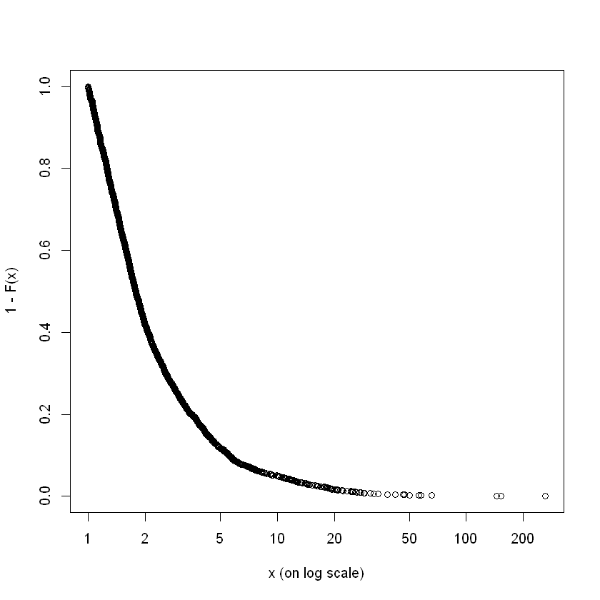
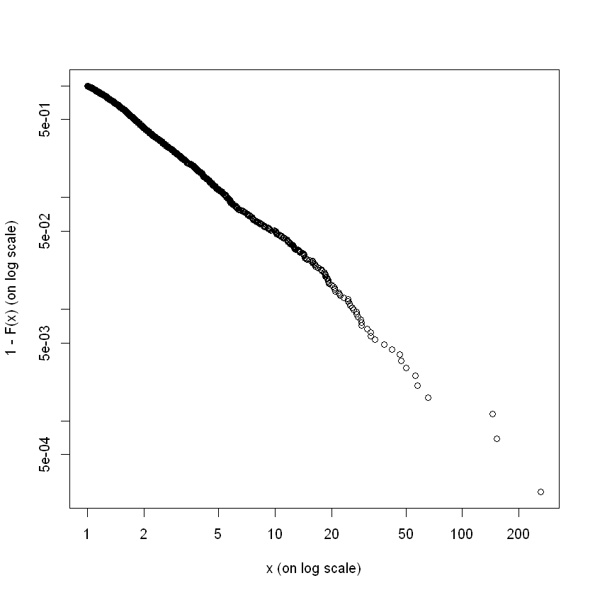
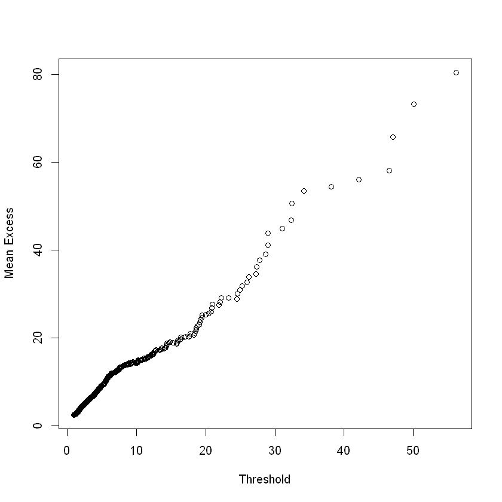
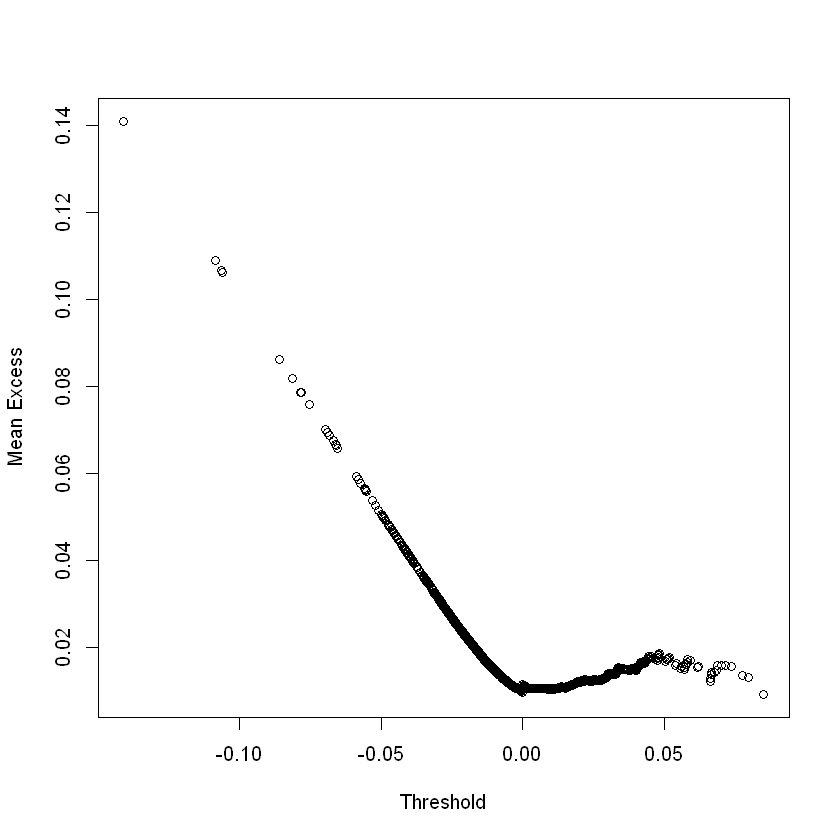
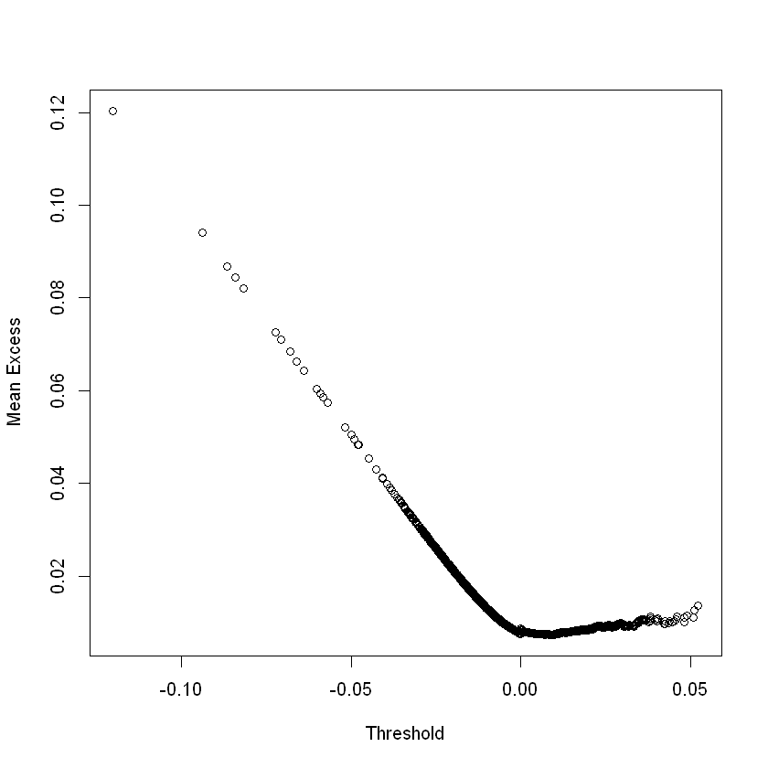
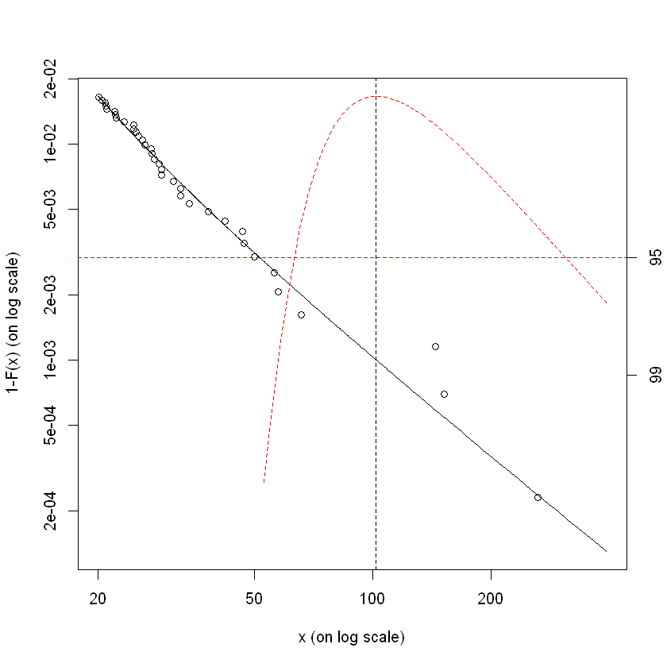
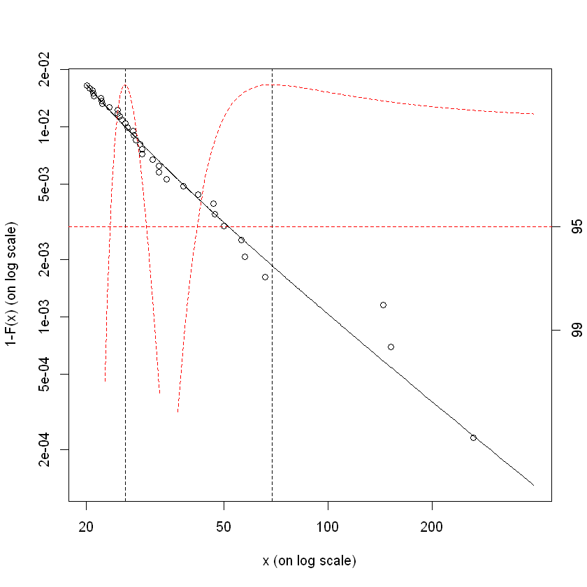

```R
one <- c(1,1) 
xval <- c(1,2) 
yval <- c(2,5) 
X <- matrix(c(one,xval),nrow=2,ncol=2) 
Y <- matrix(c(yval),nrow=2,ncol=1)
```


```R
solve(t(X) %*% X) %*% t(X) %*% Y 
```


<table>
<tbody>
	<tr><td>-1</td></tr>
	<tr><td> 3</td></tr>
</tbody>
</table>


```R
one <- c(1,1,1) 
x1val <- c(1,4,3) 
x2val <- c(2,-1,1) 
yval <- c(9,3,9) 

X <- matrix(c(one,x1val,x2val),nrow=3,ncol=3) 
Y <- matrix(c(yval),nrow=3,ncol=1)
```


```R
solve(t(X) %*% X) %*% t(X) %*% Y
```


<table>
<tbody>
	<tr><td>-1</td></tr>
	<tr><td> 2</td></tr>
	<tr><td> 4</td></tr>
</tbody>
</table>


```R
one <- c(1,1,1) 

xval <- c(1,2,3) 

yval <- c(2,5,4) 

X <- matrix(c(one,xval),nrow=3,ncol=2) 

Y <- matrix(c(yval),nrow=3,ncol=1) 
```


```R
solve(t(X) %*% X) %*% t(X) %*% Y
```


<table>
<tbody>
	<tr><td>1.666667</td></tr>
	<tr><td>1.000000</td></tr>
</tbody>
</table>


```R
one <- c(1,1,1) 

xval <- c(1,2,3) 

yval <- c(2,5,4) 

X <- matrix(c(one,xval),nrow=3,ncol=2) 

Y <- matrix(c(yval),nrow=3,ncol=1) 
```


```R
betahat = solve(t(X) %*% X) %*% t(X) %*% Y 
betahat
```


<table>
<tbody>
	<tr><td>1.666667</td></tr>
	<tr><td>1.000000</td></tr>
</tbody>
</table>


```R
SSE = t(Y) %*% Y - t(betahat) %*% t(X) %*% Y 
SSE
```


<table>
<tbody>
	<tr><td>2.666667</td></tr>
</tbody>
</table>


```R
x <- c(3,5,7,9) 
y <- c(17,23,41,50) 

t_line = lm(y ~ x) 
t_line

```


    
    Call:
    lm(formula = y ~ x)
    
    Coefficients:
    (Intercept)            x  
          -2.35         5.85  
    


```R
coeffs = coefficients(t_line)
b0 = coeffs[1] 
b1 = coeffs[2] 
yhat = b1 * x + b0
sum((y-yhat)^2)
```


24.3


```R
tsum = sum((y-mean(y))^2)
tsum
```


708.75


```R
n = length(x)
df = n - 2
se = sqrt(sum((y-yhat)^2)/df)
se
```


3.48568501158668


```R
tsum = sum((x-mean(x))^2)
tsum 
```


20


```R
clevel=.95
atl = clevel + (1 - clevel)/2 
t = qt(atl,df)
t
```


4.30265272974946


```R
lb = b1 - t * se/sqrt(tsum) 
ub = b1 + t * se/sqrt(tsum) 
lb 
ub
```


<strong>x:</strong> 2.49641408913705


<strong>x:</strong> 9.20358591086295


```R
library(evir)
data(danish)
length(danish)

```


2167


```R
emplot(danish) 

```





```R
emplot(danish, alog="xy")

```





```R
meplot(danish, omit=5)

```





```R
meplot(bmw, omit=5)
```





```R
meplot(siemens, omit=5)
```





```R
tp <- tailplot(gpdfittedparameters)
gpd.q(tp, pp = 0.999, ci.p = 0.95)
```


<dl class=dl-horizontal>
	<dt>Lower CI</dt>
		<dd>63.2784325644593</dd>
	<dt>Estimate</dt>
		<dd>102.182255843829</dd>
	<dt>Upper CI</dt>
		<dd>310.687680096456</dd>
</dl>





```R
tp <- tailplot(gpdfittedparameters)
gpd.q(tp, pp = 0.99)
gpd.sfall(tp, 0.99)
```


<dl class=dl-horizontal>
	<dt>Lower CI</dt>
		<dd>23.4401636965386</dd>
	<dt>Estimate</dt>
		<dd>25.8451037628292</dd>
	<dt>Upper CI</dt>
		<dd>29.7958674409946</dd>
</dl>


<dl class=dl-horizontal>
	<dt>Lower CI</dt>
		<dd>42.1610622858709</dd>
	<dt>Estimate</dt>
		<dd>68.9846266348609</dd>
	<dt>Upper CI</dt>
		<dd>394.875549048316</dd>
</dl>




